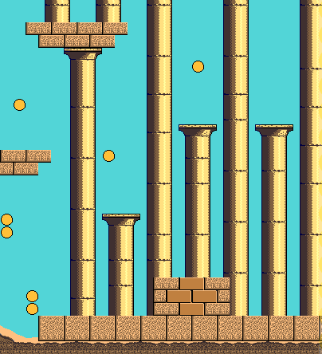
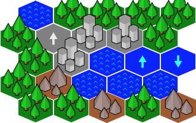
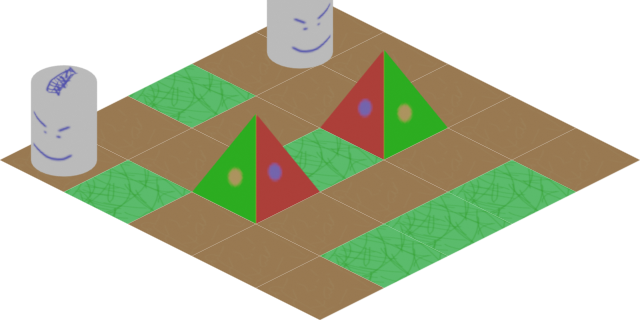

# flame_tiled

**flame_tiled**는 TMX(XML) 파일을 파싱하고 그 안의 타일, 오브젝트 등 모든 것에 접근할 수 있게 해 Flame 게임 엔진을
[Tiled] 맵과 연결하는 브릿지 패키지입니다.

사용 방법은 다음과 같습니다.

1. [Tiled]를 사용해 맵을 만듭니다.
2. 다음과 같이 `TiledComponent`를 만들어 컴포넌트 트리에 추가합니다.

```dart
final component = await TiledComponent.load(
  'assets/tiles/my_map.tmx',
  Vector2.all(32),
);

add(component);
```


## TiledComponent

Tiled는 플랫포머나 RPG 게임을 위한 무료 오픈 소스이자 모든 기능을 갖춘 레벨 및 맵 에디터입니다.
현재 Tiled 컴포넌트는 "진행 중"인 구현 상태입니다. 이 API는
[tiled.dart](https://github.com/flame-engine/tiled.dart) 라이브러리를 사용해 맵 파일을 파싱하고,
각 레이어마다 성능이 좋은 `SpriteBatch`를 사용해 보이는 레이어를 렌더링합니다.

지원하는 맵 타입은 Orthogonal, Isometric, Hexagonal, Staggered입니다.

<table class="docutils" style="text-align: center;">
  <thead>
    <tr>
      <th>Orthogonal</th>
      <th>Hexagonal</th>
      <th>Isomorphic</th>
    </tr>
  </thead>
  <tbody>
    <tr>
      <td>
        
      </td>
      <td>
        
      </td>
      <td>
        
      </td>
    </tr>
  </tbody>
</table>

API 사용 예제는
[여기](https://github.com/flame-engine/flame/tree/main/packages/flame_tiled/example)에서 찾을 수 있습니다.


### TileStack

`TiledComponent`가 로드되면 `tileStack`에서 (x,y) 타일의 열을 선택해
애니메이션을 추가할 수 있습니다. 스택을 제거해도 맵에서 타일이 제거되지는 않습니다.

> **참고**: 현재는 위치 기반 이펙트만 지원합니다.

```dart
void onLoad() {
  final stack = map.tileMap.tileStack(4, 0, named: {'floor_under'});
  stack.add(
    SequenceEffect(
      [
        MoveEffect.by(
          Vector2(5, 0),
          NoiseEffectController(duration: 1, frequency: 20),
        ),
        MoveEffect.by(Vector2.zero(), LinearEffectController(2)),
      ],
      repeatCount: 3,
    )
      ..onComplete = () => stack.removeFromParent(),
  );
  map.add(stack);
}
```


### TileAtlas

타일맵에 (여러 타일셋에서 온) 이미지가 여러 개 있으면 `TiledComponent`는 `TileAtlas`를 사용해
그 이미지들을 하나의 큰 이미지(아틀라스라고도 함)로 묶습니다. 이렇게 하면 맵 전체를
한 번의 draw call로 렌더링할 수 있습니다. 하지만 대상 플랫폼과 하드웨어에 따라 이 아틀라스의 크기에는
제한이 있습니다. 현재는 Flame이나 Flutter에서 이 최대 크기를 조회할 수 없으므로,
`TiledComponent`는 아틀라스를 웹에서는 `4096x4096`, 그 외 모든 플랫폼에서는 `8192x8192`로 제한합니다.

대부분의 경우에는 이 제한으로 충분합니다. 하지만 대상 플랫폼이 더 큰 아틀라스를 지원한다고 확신하고
`TiledComponent`가 사용하는 제한을 오버라이드하고 싶다면,
`TiledComponent.load`에 `atlasMaxX`와 `atlasMaxX` 값을 전달하면 됩니다.

참고: 이렇게 큰 크기는 모든 하드웨어에서 동작하지 않을 수 있으므로 권장하지 않습니다. 대신 원본
타일셋 이미지의 크기를 조정해 패킹했을 때 제한 안에 들어가도록 하는 것을 고려하세요.

```dart
final component = await TiledComponent.load(
  'assets/tiles/my_map.tmx',
  Vector2.all(32),
  atlasMaxX: 9216,
  atlasMaxY: 9216,
);

add(component);
```


<a id="limitations"></a>

## 제한 사항


<a id="flip"></a>

### 뒤집기

[Tiled]에는 타일을 가로나 세로로 뒤집거나 회전할 수 있는 기능이 있습니다.

`flame_tiled`도 이를 지원하지만, 큰 텍스처를 사용하면서 뒤집힌 타일이 있으면
성능이 떨어집니다. 타일맵의 뒤집기를 모두 무시하고 싶다면 생성자에서
`ignoreFlip`을 false로 설정하면 됩니다.

**참고**: 여기서 큰 텍스처란 여러 타일셋(또는 거대한 타일셋 하나)을 사용하며
그 크기의 합이 수천 단위에 이르는 경우를 말합니다.

```dart
final component = await TiledComponent.load(
  'assets/tiles/my_map.tmx',
  Vector2.all(32),
  ignoreFlip: true,
);
```


<a id="clearing-images-cache"></a>

### 이미지 캐시 비우기

`Flame.images.clearCache()`를 호출했다면, tiled 캐시에서 해제된 이미지를 제거하기 위해
`TiledAtlas.clearCache()`도 호출해야 합니다. 다음 게임 맵이 이전 맵과 완전히 다른 타일을 사용하는 경우
유용할 수 있습니다.

[Tiled]: https://www.mapeditor.org/


<a id="troubleshooting"></a>

## 문제 해결


<a id="my-game-shows-lines-and-artifacts-between-the-map-tiles"></a>

### 게임에서 맵 타일 사이에 "선"과 잔상이 보입니다

이는 컴퓨터 과학에서 부동소수점 숫자가 가진 부정확성 때문에 발생합니다.

이 문제와 해결 방법에 대해 더 알아보려면 이 [아티클](https://verygood.ventures/blog/solving-super-dashs-rendering-challenges-eliminating-ghost-lines-for-a-seamless-gaming-experience)을
확인하세요.

```{toctree}
:hidden:

Tiled  <tiled.md>
레이어 <layers.md>
```
