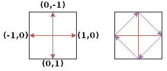

# ShapeComponents

기하학적 도형은 디버그 시각화, 절차적으로 생성되는 그래픽, UI 요소, 스프라이트 아트가 필요 없는 단순한
게임 객체 등 다양한 게임 상황에서 유용합니다. Flame의 도형 컴포넌트를 사용하면 다각형, 사각형, 원을
`PositionComponent`의 모든 변환 속성을 갖춘 일급 컴포넌트로 렌더링할 수 있습니다. 또한 이 컴포넌트들은
[충돌 감지 히트박스](../collision_detection.md#shapehitbox)의 기반이 되기도 합니다.


`ShapeComponent`는 스케일링 가능한 기하학적 도형을 나타내는 기반 클래스입니다. 도형마다 모양을
정의하는 방식은 다르지만, 모두 수정 가능한 크기와 각도를 가지며 도형 정의는 그에 맞게 도형을
스케일링하거나 회전시킵니다.

이 도형들은 [ShapeHitbox](../collision_detection.md#shapehitbox)를 사용하는 충돌 감지 시스템과
함께 쓰는 것보다 더 일반적인 방식으로 기하학적 도형을 사용하기 위한 도구입니다.


## PolygonComponent

`PolygonComponent`는 생성자에 꼭짓점(vertices)이라고 부르는 점 목록을 전달하여 만듭니다.
이 목록은 크기를 가진 다각형으로 변환되며, 여전히 스케일링과 회전이 가능합니다.

예를 들어 다음 코드는 (50, 50)부터 (100, 100)까지 이어지고 중심이 (75, 75)인 정사각형을 만듭니다:

```dart
void main() {
  PolygonComponent([
    Vector2(100, 100),
    Vector2(100, 50),
    Vector2(50, 50),
    Vector2(50, 100),
  ]);
}
```

`PolygonComponent`는 상대 꼭짓점 목록으로도 만들 수 있습니다. 상대 꼭짓점은 주어진 크기(대개는 붙일
부모의 크기)를 기준으로 정의된 점입니다.

예를 들어 다음과 같이 마름모 모양의 다각형을 만들 수 있습니다:

```dart
void main() {
  PolygonComponent.relative(
    [
      Vector2(0.0, -1.0), // 위쪽 변의 가운데
      Vector2(1.0, 0.0), // 오른쪽 변의 가운데
      Vector2(0.0, 1.0), // 아래쪽 변의 가운데
      Vector2(-1.0, 0.0), // 왼쪽 변의 가운데
    ],
    size: Vector2.all(100),
  );
}
```

예제의 꼭짓점은 x축과 y축 모두에서 중심으로부터 화면 가장자리까지 길이의 비율을 정의합니다. 여기서
좌표계는 다각형의 중심을 기준으로 정의되므로, 목록의 첫 번째 항목(`Vector2(0.0, -1.0)`)은
바운딩 박스의
위쪽 변 가운데를 가리킵니다.



이미지에서 보라색 화살표로 이루어진 다각형 도형이 빨간색 화살표로 어떻게 정의되는지 확인할 수 있습니다.


<a id="from-a-path"></a>

### Path로부터 만들기

도형의 윤곽선이 이미 `Path`로 존재할 때(예: 벡터 그래픽에서 변환한 경로), `PolygonComponent.fromPath`
생성자를 사용하면 꼭짓점을 직접 나열할 필요 없이 직선 변으로 그 윤곽선을 따라갑니다. 경로의 직선 사이
모서리는 그대로 꼭짓점이 되고, 곡선은 근사됩니다.

다음 코드는 크기가 `(100, 60)`이고 중심이 `(200, 100)`인 둥근 사각형을 만듭니다:

```dart
void main() {
  final path = Path()
    ..addRRect(
      RRect.fromRectAndRadius(
        const Rect.fromLTWH(0, 0, 100, 60),
        const Radius.circular(20),
      ),
    );

  PolygonComponent.fromPath(
    path,
    position: Vector2(200, 100),
    anchor: Anchor.center,
  );
}
```

컴포넌트는 윤곽선(contour)의 크기를 가지므로, 경로의 경계까지 닿는 곡선이 잘리지 않습니다. `position`을
지정하지 않으면 다각형은 경로 좌표상의 윤곽선 위치에 놓입니다.

경로를 따라가는 방식을 제어하는 인자는 두 가지입니다:

- `contour`: 경로에는 추가된 도형마다, 그리고 `moveTo`마다 하나의 윤곽선이 있습니다. 이 값은 다각형을
  만들 윤곽선의 인덱스이며, 기본값은 첫 번째 윤곽선입니다. 경로에 없는 인덱스를 지정하면
  `RangeError`가 발생합니다.
- `sampling`: 곡선을 따라갈 때의 간격으로, 경로의 단위를 사용하며 기본값은 `1.0`입니다. 다각형은
  경로로부터 이 값의 약 절반 이내에 머뭅니다. 값이 클수록 꼭짓점이 적어져 충돌 감지와 레이 캐스팅
  비용이 줄고, 값이 작을수록 곡선을 더 정확하게 따라갑니다. 미터처럼 작은 단위로 정의된 경로에는 그
  크기에 비해 작은 sampling 값이 필요합니다. 직선 구간은 sampling 값과 관계없이 비용이 같습니다.

이 생성자는 `Path`와 `PathMetric`의 확장 메서드인 `walkContours`, `walkContourAt`, `walkContour`를
기반으로 만들어졌으며, 이 메서드들은 꼭짓점을 `Offset` 목록으로 반환합니다. 샘플링한 윤곽선을 단순화할
때 sampling 값을 따르지 않게 하고 싶다면 이 메서드들에 `tolerance`를 지정할 수도 있습니다.

```dart
void main() {
  final path = Path()
    ..addOval(const Rect.fromLTWH(0, 0, 100, 60))
    ..addRect(const Rect.fromLTWH(200, 0, 50, 50));

  // 경로의 윤곽선마다 하나씩 offset 목록이 만들어집니다.
  final contours = path.walkContours();
  // 사각형만, 간격 2로 샘플링하고 허용 오차 0.5로
  // 단순화합니다.
  final rectangle = path.walkContourAt(1, 2, 0.5);
}
```


## RectangleComponent

`RectangleComponent`도 바운딩 사각형을 가지므로 `PositionComponent`를 만드는 방식과 매우 비슷하게
만듭니다.

예를 들면 다음과 같습니다:

```dart
void main() {
  RectangleComponent(
    position: Vector2(10.0, 15.0),
    size: Vector2.all(10),
    angle: pi/2,
    anchor: Anchor.center,
  );
}
```

Dart에는 이미 사각형을 만드는 훌륭한 방법인 `Rect` 클래스가 있습니다.
`RectangleComponent.fromRect` 팩토리를 사용하면 `Rect`로부터 Flame `RectangleComponent`를 만들 수
있으며, `PolygonComponent`의 꼭짓점을 설정할 때와 마찬가지로 이 생성자를 사용하면 사각형의 크기가
`Rect`에 맞춰 정해집니다.

다음 코드는 왼쪽 위 모서리가 `(10, 10)`이고 크기가 `(100, 50)`인 `RectangleComponent`를 만듭니다.

```dart
void main() {
  RectangleComponent.fromRect(
    Rect.fromLTWH(10, 10, 100, 50),
  );
}
```

붙일 부모의 크기에 대한 비율을 정의하여 `RectangleComponent`를 만들 수도 있으며, 기본 생성자로
위치, 크기, 각도로부터 사각형을 만들 수도 있습니다. `relation`은 부모 크기를 기준으로 정의된 벡터로,
예를 들어 `relation`이 `Vector2(0.5, 0.8)`이면 부모 크기의 너비 50%, 높이 80%인 사각형이
만들어집니다.

아래 예제에서는 크기가 `(25.0, 30.0)`이고 `(100, 100)`에 위치한 `RectangleComponent`가 만들어집니다.

```dart
void main() {
  RectangleComponent.relative(
    Vector2(0.5, 1.0),
    position: Vector2.all(100),
    size: Vector2(50, 30),
  );
}
```

정사각형은 사각형을 단순화한 형태이므로, 정사각형 `RectangleComponent`를 만드는 생성자도 있습니다.
유일한 차이는 `size` 인자가 `Vector2`가 아니라 `double`이라는 점입니다.

```dart
void main() {
  RectangleComponent.square(
    position: Vector2.all(100),
    size: 200,
  );
}
```


## CircleComponent

원의 위치나 반지름 길이를 처음부터 알고 있다면 선택적 인자 `radius`와 `position`으로 이를 설정할 수
있습니다.

다음 코드는 중심이 `(100, 100)`이고 반지름이 5, 따라서 크기가 `Vector2(10, 10)`인
`CircleComponent`를 만듭니다.

```dart
void main() {
  CircleComponent(radius: 5, position: Vector2.all(100), anchor: Anchor.center);
}
```

`relative` 생성자로 `CircleComponent`를 만들 때는 `size`로 정의된 바운딩 박스의 가장 짧은 변과 비교해
반지름의 길이를 정의할 수 있습니다.

다음 예제는 반지름이 40(지름 80)인 원을 정의하는 `CircleComponent`를 만듭니다.

```dart
void main() {
  CircleComponent.relative(0.8, size: Vector2.all(100));
}
```
