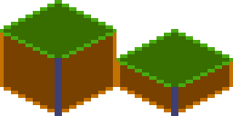
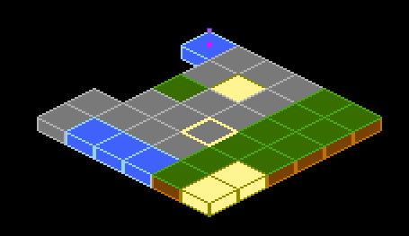

<a id="utility-components"></a>

# 유틸리티 컴포넌트

Flame은 핵심 시각 컴포넌트 외에도 시간에 따라 객체 생성하기, 타일 맵 렌더링하기, 렌더링 영역 자르기,
Flutter 위젯을 게임에 연결하기 등 게임 개발에서 흔히 하는 작업을 처리하는 여러 유틸리티 컴포넌트를
제공합니다. 이 컴포넌트들 덕분에 반복적인 코드를 작성하지 않고 게임 고유의 로직에 집중할 수 있습니다.


## SpawnComponent

이 컴포넌트는 `SpawnComponent`의 부모 안에 다른 컴포넌트를 생성(spawn)하는, 화면에 보이지 않는
컴포넌트입니다. 예를 들어 특정 영역 안에 적이나 파워업을 무작위로 생성하고 싶을 때 아주 좋습니다.

`SpawnComponent`는 새 컴포넌트를 만드는 데 사용할 팩토리 함수와, 컴포넌트를 생성할 영역(또는 그
영역의 가장자리)을 받습니다.

영역에는 `Circle`, `Rectangle`, `Polygon` 클래스를 사용할 수 있으며, 도형의 가장자리를 따라서만
컴포넌트를 생성하고 싶다면 `within` 인자를 false로 설정합니다(기본값은 true).

예를 들어 다음 코드는 정의된 원 안의 무작위 위치에 0.5초마다 `MyComponent` 타입의 새 컴포넌트를
생성합니다:

이 컴포넌트는 두 가지 유형의 팩토리를 지원합니다. `factory`는 컴포넌트 하나를 반환하고,
`multiFactory`는 한 번에 추가될 컴포넌트 목록을 반환합니다.

팩토리 함수는 지금까지 생성된 컴포넌트 수를 나타내는 `int`를 인자로 받습니다. 첫 호출의 카운트가
0부터 시작하므로, 예를 들어 이미 4개의 컴포넌트가 생성되었다면 팩토리 메서드의 5번째 호출은
`amount=4`로 호출됩니다.

컴포넌트 하나를 반환하는 `factory`는 하위 호환성을 위한 것이므로, 확실하지 않다면 `multiFactory`를
사용하세요. 단일 컴포넌트 `factory`는 내부적으로 항목 하나짜리 목록을 반환하도록 감싸진 뒤
`multiFactory`로 사용됩니다.

일정 개수의 컴포넌트만 생성하고 싶다면 `spawnCount` 인자를 사용할 수 있습니다. 한도에 도달하면
`SpawnComponent`는 생성을 멈추고 스스로를 제거합니다.

기본적으로 `SpawnComponent`는 자신의 부모에 컴포넌트를 생성하지만, 다른 컴포넌트에 생성하고 싶다면
`target` 인자를 설정할 수 있습니다. `area`나 `selfPositioning` 인자를 사용하지 않는다면 이 대상은
크기를 가진 `Component`여야 한다는 점을 기억하세요.


```dart
SpawnComponent(
  factory: (i) => MyComponent(size: Vector2(10, 20)),
  period: 0.5,
  area: Circle(Vector2(100, 200), 150),
);
```

생성 주기를 고정하고 싶지 않다면 `minPeriod`와 `maxPeriod` 인자를 받는 `SpawnComponent.periodRange`
생성자를 대신 사용할 수 있습니다.
다음 예제에서는 컴포넌트가 원 안의 무작위 위치에 생성되며, 각 컴포넌트가 생성되는 간격은 0.5초에서
10초 사이입니다.

```dart
SpawnComponent.periodRange(
  factory: (i) => MyComponent(size: Vector2(10, 20)),
  minPeriod: 0.5,
  maxPeriod: 10,
  area: Circle(Vector2(100, 200), 150),
);
```

`factory` 함수 안에서 위치를 직접 설정하고 싶다면 생성자에 `selfPositioning = true`를 설정하면 됩니다.
그러면 `area` 인자를 무시하고 위치를 직접 설정할 수 있습니다.

```dart
SpawnComponent(
  factory: (i) =>
    MyComponent(position: Vector2(100, 200), size: Vector2(10, 20)),
  selfPositioning: true,
  period: 0.5,
);
```


## SvgComponent

**참고**: Flame에서 SVG를 사용하려면 [`flame_svg`](https://github.com/flame-engine/flame_svg) 패키지를
사용하세요.

이 컴포넌트는 `Svg` 클래스의 인스턴스를 사용하여, 게임에 렌더링되는 SVG를 가진 컴포넌트를 나타냅니다:

```dart
@override
Future<void> onLoad() async {
  final svg = await Svg.load('assets/android.svg');
  final android = SvgComponent.fromSvg(
    svg,
    position: Vector2.all(100),
    size: Vector2.all(100),
  );
}
```


## IsometricTileMapComponent

아이소메트릭 타일 맵은 2D 맵에 유사 3D 원근감을 주기 위해 전략, 시뮬레이션, RPG 게임에서 흔히
사용됩니다. 이 컴포넌트를 사용하면 블록으로 이루어진 직교 좌표 행렬과 아이소메트릭 타일셋을 바탕으로
아이소메트릭 맵을 렌더링할 수 있습니다.

간단한 사용 예:

```dart
// 타일셋을 만듭니다. 블록 id는 0부터 시작해 왼쪽에서 오른쪽으로,
// 그다음 위에서 아래로 순서대로 자동 할당됩니다.
final tilesetImage = await images.load('assets/images/tileset.png');
final tileset = SpriteSheet(image: tilesetImage, srcSize: Vector2.all(32));
// 각 요소는 블록 id이며, -1은 비어 있음을 뜻합니다
final matrix = [[0, 1, 0], [1, 0, 0], [1, 1, 1]];
add(IsometricTileMapComponent(tileset, matrix));
```

좌표를 변환하는 메서드도 제공하므로 클릭이나 호버 처리, 타일 위에 엔티티 렌더링, 선택기(selector)
추가 등을 할 수 있습니다.

`tileHeight`도 지정할 수 있습니다. 이는 타일에 있는 각 직육면체의 아래 면과 위 면 사이의 수직
거리입니다. 쉽게 말해 직육면체의 가장 앞쪽 모서리의 높이이며, 보통 타일 크기의 절반(기본값)이나
4분의 1입니다. 아래 이미지에서 더 어두운 색으로 칠해진 부분이 높이입니다:



다음은 4분의 1 길이 맵의 모습을 보여 주는 예입니다:



Flame의 예제 앱에는 좌표를 해석해 선택기를 만드는 방법을 보여 주는 더 자세한 예제가 있습니다.
[소스 코드](https://github.com/flame-engine/flame/blob/main/examples/lib/stories/rendering/isometric_tile_map_example.dart)는
GitHub에서 확인할 수 있으며,
[라이브 버전](https://examples.flame-engine.org/#/Rendering_Isometric_Tile_Map)은
브라우저에서 볼 수 있습니다.


## NineTileBoxComponent

Nine Tile Box는 그리드 스프라이트를 사용해 그리는 사각형입니다.

그리드 스프라이트는 9개의 블록으로 이루어진 3x3 그리드로, 4개의 모서리, 4개의 변, 가운데를
나타냅니다.

모서리는 같은 크기로 그려지고, 변은 변의 방향으로 늘어나며, 가운데는 양방향으로 확장됩니다.

이를 사용하면 어떤 크기로도 잘 늘어나는 상자/사각형을 얻을 수 있습니다. 패널, 다이얼로그, 테두리를
만들 때 유용합니다.

사용 방법에 대한 자세한 내용은 예제 앱
[nine_tile_box](https://github.com/flame-engine/flame/blob/main/examples/lib/stories/rendering/nine_tile_box_example.dart)를
확인하세요.


## CustomPainterComponent

`CustomPainter`는 Flutter 애플리케이션 안에서 커스텀 도형을 렌더링하기 위해 `CustomPaint` 위젯과 함께
사용하는 Flutter 클래스입니다.

Flame은 `CustomPainter`를 렌더링할 수 있는 `CustomPainterComponent`라는 컴포넌트를 제공합니다. 이
컴포넌트는 custom painter를 받아 게임 캔버스에 렌더링합니다.

이를 사용하면 Flame 게임과 Flutter 위젯 사이에서 커스텀 렌더링 로직을 공유할 수 있습니다.

사용 방법에 대한 자세한 내용은 예제 앱
[custom_painter_component](https://github.com/flame-engine/flame/blob/main/examples/lib/stories/widgets/custom_painter_example.dart)를
확인하세요.


## ComponentsNotifier

대부분의 경우 자식과 그 속성에 접근하는 것만으로도 게임 로직을 만들기에 충분합니다.

하지만 때로는 반응성(reactivity)이 개발자가 코드를 단순화하고 더 좋은 코드를 작성하는 데 도움이 될 수
있습니다. 이를 위해 Flame은 `ComponentsNotifier`를 제공합니다. 이는 컴포넌트가 추가되거나, 제거되거나,
수동으로 변경될 때마다 리스너에게 알리는 `ChangeNotifier` 구현입니다.

예를 들어 플레이어의 목숨이 0이 되면 게임 오버 텍스트를 표시하고 싶다고 해 봅시다.

새 인스턴스가 추가되거나 제거될 때 컴포넌트가 자동으로 알리게 하려면 컴포넌트 클래스에 `Notifier`
믹스인을 적용합니다:

```dart
class Player extends SpriteComponent with Notifier {}
```

그런 다음 해당 컴포넌트의 변경을 수신하려면 `FlameGame`의 `componentsNotifier` 메서드를 사용합니다:

```dart
class MyGame extends FlameGame {
  int lives = 2;

  @override
  void onLoad() {
    final playerNotifier = componentsNotifier<Player>()
        ..addListener(() {
          final player = playerNotifier.single;
          if (player == null) {
            lives--;
            if (lives == 0) {
              add(GameOverComponent());
            } else {
              add(Player());
            }
          }
        });
  }
}
```

`Notifier` 컴포넌트는 무언가 바뀌었다는 것을 리스너에게 수동으로 알릴 수도 있습니다. 위 예제를 확장해
플레이어의 체력이 절반이 되면 HUD 컴포넌트가 깜빡이게 해 봅시다. 그러려면 `Player` 컴포넌트가 변경을
수동으로 알려야 합니다:

```dart
class Player extends SpriteComponent with Notifier {
  double health = 1;

  void takeHit() {
    health -= .1;
    if (health == 0) {
      removeFromParent();
    } else if (health <= .5) {
      notifyListeners();
    }
  }
}
```

그러면 HUD 컴포넌트는 다음과 같이 작성할 수 있습니다:

```dart
class Hud extends PositionComponent with HasGameRef {

  @override
  void onLoad() {
    final playerNotifier = gameRef.componentsNotifier<Player>()
        ..addListener(() {
          final player = playerNotifier.single;
          if (player != null) {
            if (player.health <= .5) {
              add(BlinkEffect());
            }
          }
        });
  }
}
```

`ComponentsNotifier`는 `FlameGame` 내부의 상태가 바뀔 때 위젯을 다시 빌드하는 데에도 유용합니다. 이를
위해 Flame은 `ComponentsNotifierBuilder` 위젯을 제공합니다.

사용 예는
[ComponentsNotifier 예제](https://github.com/flame-engine/flame/blob/main/examples/lib/stories/components/components_notifier_example.dart)를
확인하세요.


## ClipComponent

`ClipComponent`는 캔버스를 자신의 크기와 모양으로 잘라내는(clip) 컴포넌트입니다. 즉 컴포넌트 자신이나
`ClipComponent`의 자식이 `ClipComponent`의 경계 밖에 렌더링되면, 영역 밖에 있는 부분은 표시되지
않습니다.

`ClipComponent`는 자신의 크기를 바탕으로 잘라낼 영역을 정의하는 `Shape`를 반환하는 builder 함수를
받습니다.

이 컴포넌트를 더 쉽게 사용할 수 있도록 흔히 쓰이는 도형을 제공하는 세 가지 팩토리가 있습니다:

- `ClipComponent.rectangle`: 크기를 바탕으로 사각형 모양으로 영역을 잘라냅니다.
- `ClipComponent.circle`: 크기를 바탕으로 원 모양으로 영역을 잘라냅니다.
- `ClipComponent.polygon`: 생성자에서 받은 점들을 바탕으로 다각형 모양으로 영역을 잘라냅니다.

사용 방법에 대한 자세한 내용은 예제 앱
[clip_component](https://github.com/flame-engine/flame/blob/main/examples/lib/stories/components/clip_component_example.dart)를
확인하세요.
