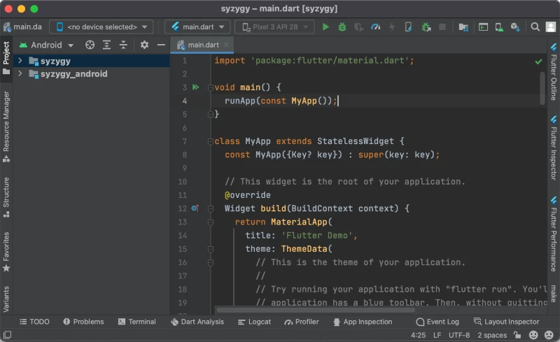
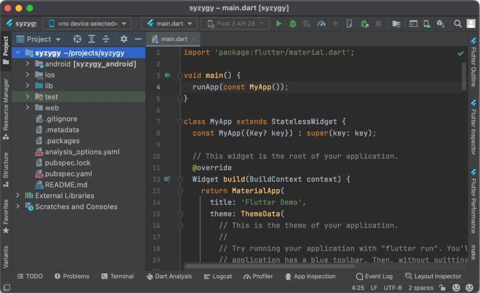

<a id="bare-flame-game"></a>

# 빈 Flame 게임

이 튜토리얼은 여러분이 커맨드 라인 사용에 기본적으로 익숙하며, 컴퓨터에 다음 프로그램(모두 무료)이
설치되어 있다고 가정합니다.

- [Flutter], 버전 3.13.0 이상.
- [Android Studio] 또는 [Visual Studio Code] 같은 다른 IDE.
- [git] (선택 사항), 프로젝트를 GitHub에 저장하기 위해 사용합니다.


<a id="1-check-flutter-installation"></a>

## 1. Flutter 설치 확인

먼저 Flutter SDK가 올바르게 설치되었고 커맨드 라인에서 접근할 수 있는지 확인해 봅시다.

```shell
$ flutter doctor
Doctor summary (to see all details, run flutter doctor -v):
[✓] Flutter (Channel stable, 3.13.7, on macOS 13.6 22G120 darwin-arm64, locale en)
[✓] Android toolchain - develop for Android devices (Android SDK version 33.0.0)
[✓] Xcode - develop for iOS and macOS (Xcode 15.0)
[✓] Chrome - develop for the web
[✓] Android Studio (version 2021.2)
[✓] IntelliJ IDEA Community Edition (version 2022.2.2)
[✓] VS Code (version 1.83.0)
[✓] Connected device (2 available)
[✓] Network resources

• No issues found!
```

출력 결과는 조금 다를 수 있지만, 중요한 것은 보고된 오류가 없는지, 그리고 Flutter 버전이 최소
**3.13.0** 이상인지 확인하는 것입니다.


<a id="2-create-the-project-directory"></a>

## 2. 프로젝트 디렉터리 만들기

이제 프로젝트 이름을 정해야 합니다. 이름에는 소문자 라틴 문자, 숫자, 밑줄만 사용할 수 있습니다.
또한 유효한 Dart 식별자여야 합니다(따라서 예를 들어 키워드는 사용할 수 없습니다). 이 튜토리얼에서는
프로젝트 이름을 **syzygy**라고 하겠습니다. 절대 지어낸 단어가 아닌, 실제로 존재하는 단어입니다.

새 프로젝트를 위한 디렉터리를 만듭니다.

```shell
mkdir -p ~/projects/syzygy
cd ~/projects/syzygy
```


<a id="3-initialize-empty-flutter-project"></a>

## 3. 빈 Flutter 프로젝트 초기화

이 황량한 디렉터리를 실제 Flutter 프로젝트로 바꾸려면 다음 명령을 실행합니다.

```shell
flutter create .
```

(간결함을 위해 출력은 생략했지만, 출력이 꽤 많이 나옵니다.)

프로젝트 파일이 정상적으로 생성되었는지 확인할 수 있습니다.

```shell
$ ls
README.md               android/   lib/           pubspec.yaml   test/
analysis_options.yaml   ios/       pubspec.lock   syzygy.iml     web/
```


<a id="4-open-the-project-in-android-studio"></a>

## 4. Android Studio에서 프로젝트 열기

Android Studio를 실행한 다음, 프로젝트 선택 창에서 `[Open]`을 선택하고 프로젝트 디렉터리로
이동합니다. 운이 좋다면 프로젝트가 이제 다음과 같이 보일 것입니다.



`main.dart` 파일만 보이고 사이드 패널이 보이지 않는다면, 창 왼쪽 가장자리에 있는 세로 방향의
`[Project]` 버튼을 클릭합니다.

계속하기 전에 왼쪽 패널의 보기를 바로잡아 봅시다. 스크린샷에서 `[Android]`라고 적힌 왼쪽 위 모서리의
버튼을 찾습니다. 이 드롭다운에서 첫 번째 옵션인 "Project"를 선택합니다. 이제 프로젝트 창은 다음과
같이 보여야 합니다.



중요한 점은 프로젝트 디렉터리의 모든 파일을 볼 수 있어야 한다는 것입니다.


<a id="5-clean-up-the-project-files"></a>

## 5. 프로젝트 파일 정리

Flutter가 만든 기본 프로젝트는 Flame 게임을 만드는 데 그다지 유용하지 않으므로 정리해야
합니다.

먼저 `pubspec.yaml` 파일을 열고 다음 코드로 바꿉니다(`name`과 `description`은 프로젝트에 맞게
조정합니다).

```yaml
name: syzygy
description: Syzygy Flame game
version: 0.0.0
publish_to: none

environment:
  sdk: ^3.0.0
  flutter: ^3.13.0

dependencies:
  flutter:
    sdk: flutter
  flame: ^--VERSION--
```

그런 다음 창 상단의 `[Pub get]` 버튼을 누르거나, 터미널에서 `flutter
pub get` 명령을 실행합니다. 이렇게 하면 `pubspec` 파일의 변경 사항이 프로젝트에 "적용"되며,
특히 의존성으로 선언한 Flame 라이브러리를 다운로드합니다. 앞으로 이 파일을 변경할 때마다
`flutter pub get`을 실행해야 합니다.

이제 `lib/main.dart` 파일을 열고 내용을 다음으로 바꿉니다.

```dart
import 'package:flame/game.dart';
import 'package:flutter/widgets.dart';

void main() {
  final game = FlameGame();
  runApp(GameWidget(game: game));
}
```

마지막으로 `test/widget_test.dart` 파일을 완전히 삭제합니다.


<a id="6-run-the-project"></a>

## 6. 프로젝트 실행

모든 것이 의도대로 동작하고 프로젝트가 실행되는지 확인해 봅시다.

창 상단의 메뉴 바에서 `<no device selected>`라고 적힌 드롭다운을 찾습니다. 그 드롭다운에서
대신 `<Chrome (web)>`을 선택합니다.

그런 다음 `main.dart` 파일을 열고 4번째 줄의 `void main()` 함수 옆에 있는 초록색 화살표를
누릅니다. 메뉴에서 `[Run main.dart]`를 선택합니다.

그러면 새 Chrome 창이 열리고(10~30초 정도 걸릴 수 있습니다) 그 창에서 프로젝트가 실행됩니다.
지금은 단순히 검은 화면만 보이는데, 게임을 가장 단순한 빈 구성으로 만들었으므로 예상된 결과입니다.


<a id="7-sync-to-github"></a>

## 7. GitHub에 동기화

마지막 단계는 프로젝트를 GitHub에 업로드하는 것입니다. 필수는 아니지만 코드의 백업 역할을 하므로
강력히 권장합니다. 이 단계는 이미 GitHub 계정이 있다고 가정합니다.

GitHub 계정에 로그인하고, 프로필 드롭다운에서 `[Your repositories]`를 선택한 다음 초록색 `[New]`
버튼을 누릅니다. 양식에서 저장소 이름을 프로젝트 이름과 같게 입력하고, 유형은 "private"을 선택하며,
`README`, `license`, `.gitignore` 같은 초기 파일은 추가하지 않도록 합니다.

이제 터미널에서 프로젝트 디렉터리로 이동해 다음 명령을 실행합니다(URL은 방금 만든 저장소의
링크로 바꿔야 합니다).

```shell
git init
git add --all
git commit -m 'Initial commit'
git remote add origin https://github.com/your-github-username/syzygy.git
git branch -M main
git push -u origin main
```

이제 GitHub의 저장소 페이지로 가 보면 모든 프로젝트 파일이 올라가 있는 것을 볼 수 있습니다.


<a id="8-done"></a>

## 8. 완료

끝났습니다! 지금까지 여러분은

- 빈 초기 상태의 Flame 프로젝트를 만들었고,
- 그 프로젝트를 위한 Android Studio IDE를 설정했으며,
- 프로젝트용 GitHub 저장소를 만들었습니다.

즐거운 코딩 되세요!


[Flutter]: https://docs.flutter.dev/get-started/install
[git]: https://git-scm.com/downloads
[Android Studio]: https://developer.android.com/studio
[Visual Studio Code]: https://code.visualstudio.com/download
