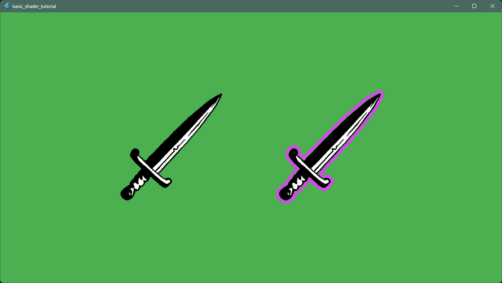

<a id="3-shader"></a>

# 3. 셰이더


<a id="considerations"></a>

## 고려 사항

이 섹션에서는 GPU에서 실행되는 프래그먼트(픽셀) 셰이더 프로그램을 만듭니다.

프래그먼트 셰이더는 매 프레임 픽셀마다 한 번씩 실행되므로, 셰이더 코드는 일반적인 Dart 코드와는
다른 사고방식이 필요하다는 점을 기억하세요.

```{note}
셰이더에서의 분기와 반복에 주의하세요. 연산량이 픽셀 수와
프레임당 반복 횟수에 비례해 선형적으로 늘어납니다.
```

```{note}
셰이더 최적화는 이 튜토리얼의 범위를 벗어납니다. 간단한
예를 들면, `sqrt`를 사용하는 대신 거리의 제곱을
비교하는 것이 더 효율적입니다.
```


<a id="shader-code"></a>

## 셰이더 코드

`assets/shaders/`에 새 디렉터리를 만들고 `outline.frag`라는 파일을 만듭니다.

```glsl
#version 460 core

precision mediump float;

#include <flutter/runtime_effect.glsl>

uniform vec2 uSize;
uniform float uOutlineWidth;
uniform vec4 uOutlineColor;
uniform sampler2D uTexture;

const int MAX_SAMPLE_DISTANCE = 8;

out vec4 fragColor;

void main() {
  vec2 uv = FlutterFragCoord().xy / uSize;
  vec4 texColor = texture(uTexture, uv);

  // 현재 픽셀이 투명하지 않으면 원래 색상을 렌더링합니다
  if (texColor.a > 0.0) {
    fragColor = texColor;
    return;
  }

  // 외곽선을 위해 주변 픽셀을 확인합니다
  vec2 texelSize = 1.0 / uSize;
  bool foundOpaqueNearby = false;

  // 현재 픽셀 주위의 정사각형 패턴으로 샘플링합니다
  // GLSL에서는 반복 횟수로 정적 상수를 사용해야 합니다
  for (int x = -MAX_SAMPLE_DISTANCE; x <= MAX_SAMPLE_DISTANCE; x++) {
    for (int y = -MAX_SAMPLE_DISTANCE; y <= MAX_SAMPLE_DISTANCE; y++) {
      if (x == 0 && y == 0) continue;

      // 맨해튼 거리 대신 실제 거리를 확인합니다
      float distance = sqrt(float( x*x + y*y ));
      if (distance > uOutlineWidth) continue;

      // 현재 픽셀(uv)에서 이동한 위치의 픽셀을 샘플링합니다
      vec2 offset = vec2(float(x), float(y)) * texelSize;
      vec4 sampleColor = texture(uTexture, uv + offset);

      if (sampleColor.a > 0.0) {
        // 반복 중에 불투명한 색상을 찾았습니다 --> 근처에 스프라이트가 있습니다
        foundOpaqueNearby = true;
        break;
      }
    }
    // 바깥쪽 반복문에서도 빠져나옵니다
    if (foundOpaqueNearby) break;
  }

  if (foundOpaqueNearby) {
    fragColor = uOutlineColor;
  } else {
    fragColor = vec4(0.0, 0.0, 0.0, 0.0);
  }
}
```

셰이더는 투명한 각 픽셀에 대해 주변 픽셀 중 불투명한 것이 있는지 확인합니다. 있다면 그 픽셀을
(uniform으로 전달된) 외곽선 색상으로 칠합니다. 그렇지 않으면 완전히 투명한 상태로 둡니다.
투명한 `.png` 이미지가 필요한 이유가 바로 이것입니다.

```{note}
GLSL의 반복 범위는 컴파일 타임 상수여야 하므로
`uOutlineWidth` uniform을 직접 사용할 수 없습니다.
`MAX_SAMPLE_DISTANCE`가 Dart에서 설정한 외곽선 두께
이상인지 확인하세요.
```


<a id="shader-resource"></a>

## 셰이더 리소스

Flutter가 빌드 시 셰이더를 번들링하도록 `pubspec.yaml`에 셰이더를 등록합니다.

```yaml
flutter:
  assets:
    - assets/images/
  shaders:
    - assets/shaders/outline.frag
```

애플리케이션을 실행합니다. 이제 두 개의 스프라이트가 보일 것입니다. 하나는 일반 스프라이트이고, 다른 하나는 색상 외곽선이 있는 스프라이트입니다.



기본 셰이더가 동작합니다. 이제 실험해 볼 차례입니다!
