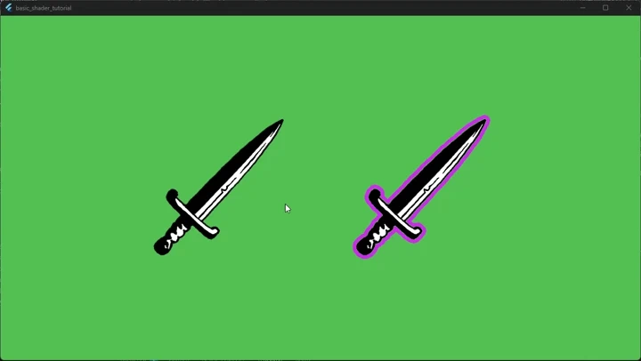

<a id="4-user-input"></a>

# 4. 사용자 입력

이 단계에서는 커서가 스프라이트 위에 올라갔을 때 외곽선 색상이 바뀌도록 마우스 호버 지원을
추가합니다.


<a id="event-handling"></a>

## 이벤트 처리

`sword_component.dart`를 열고 `OutlinedSwordSprite`에 `HoverCallbacks` 믹스인을 추가합니다.

```dart
import 'package:flame/events.dart';

class OutlinedSwordSprite extends PostProcessComponent
    with HoverCallbacks {
  // ...
}
```

그런 다음 원래 색상을 저장할 필드를 추가하고, 호버 콜백을 오버라이드해 색상을 바꿉니다.

```dart
Color? _originalPostProcessColor;

@override
void onHoverEnter() {
  super.onHoverEnter();

  final outlinePostProcess = postProcess as OutlinePostProcess;
  _originalPostProcessColor = outlinePostProcess.outlineColor;
  outlinePostProcess.outlineColor = Colors.blue;
}

@override
void onHoverExit() {
  final outlinePostProcess = postProcess as OutlinePostProcess;
  outlinePostProcess.outlineColor =
      _originalPostProcessColor ?? Colors.purpleAccent;

  super.onHoverExit();
}
```


<a id="full-solution"></a>

## 전체 코드

호버를 지원하는 최종 `sword_component.dart`는 다음과 같습니다.

```dart
import 'package:flutter/material.dart';

import 'package:flame/components.dart';
import 'package:flame/events.dart';
import 'package:flame/post_process.dart';

import 'package:basic_shader_tutorial/outline_postprocess.dart';

class OutlinedSwordSprite extends PostProcessComponent
    with HoverCallbacks {
  OutlinedSwordSprite({super.position, super.anchor})
    : super(
        children: [SwordSprite()],
        postProcess: OutlinePostProcess(anchor: anchor ?? Anchor.topLeft),
      );

  @override
  void onChildrenChanged(
    Component component,
    ChildrenChangeType changeType,
  ) {
    _recalculateBoundingSize();
    super.onChildrenChanged(component, changeType);
  }

  void _recalculateBoundingSize() {
    final boundingBox = Vector2.zero();

    final rectChildren = children.query<PositionComponent>();
    if (rectChildren.isNotEmpty) {
      final boundingRect = rectChildren
          .map((child) => child.toRect())
          .reduce((a, b) => a.expandToInclude(b));

      boundingBox.setValues(boundingRect.width, boundingRect.height);
    }

    size = boundingBox;
  }

  Color? _originalPostProcessColor;

  @override
  void onHoverEnter() {
    super.onHoverEnter();

    final outlinePostProcess = postProcess as OutlinePostProcess;
    _originalPostProcessColor = outlinePostProcess.outlineColor;
    outlinePostProcess.outlineColor = Colors.blue;
  }

  @override
  void onHoverExit() {
    final outlinePostProcess = postProcess as OutlinePostProcess;
    outlinePostProcess.outlineColor =
        _originalPostProcessColor ?? Colors.purpleAccent;

    super.onHoverExit();
  }
}

class SwordSprite extends SpriteComponent {
  @override
  Future<void> onLoad() async {
    sprite = await Sprite.load('assets/images/sword.png');
    size = sprite!.srcSize;
  }
}
```

스프라이트 위에 마우스를 올리면 외곽선이 파란색으로 바뀝니다. 커서가 벗어나면 원래 색상으로
돌아갑니다.


