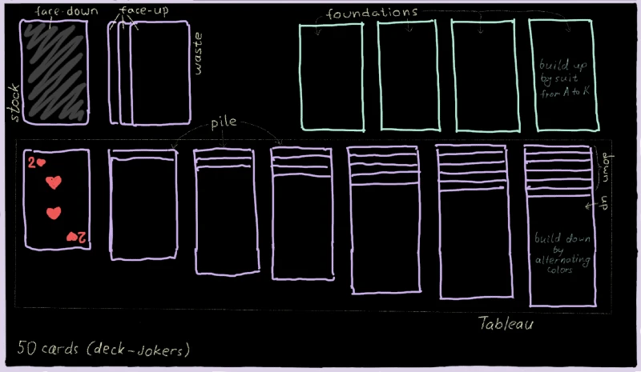
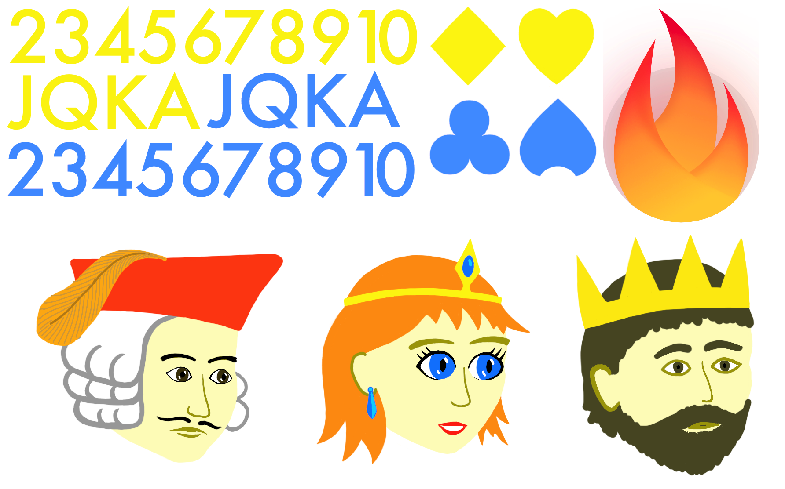

<a id="1-preparation"></a>

# 1. 준비

어떤 게임 프로젝트든 시작하기 전에 먼저 **이름**을 정해야 합니다. 이
튜토리얼에서는 이름을 간단히 `klondike`로 하겠습니다.

이 이름을 정했다면 [튜토리얼](../bare_flame_game.md)로 가서
필요한 설정 단계를 마치세요. 돌아왔을 때는 다음 내용이 담긴
`main.dart` 파일이 이미 있어야 합니다.

```dart
import 'package:flame/game.dart';
import 'package:flutter/widgets.dart';

void main() {
  final game = FlameGame();
  runApp(GameWidget(game: game));
}
```


<a id="planning"></a>

## 계획 세우기

어떤 프로젝트든 시작은 보통 막막하게 느껴집니다. 대체 어디서부터 시작해야 할까요?
저는 앞으로 코딩할 내용을 대략적으로 스케치해 두면 늘 도움이 된다고 느낍니다.
스케치가 기준점 역할을 해 주기 때문입니다. 클론다이크 게임에 대한 제 스케치는
아래와 같습니다.



여기서 게임의 전체 레이아웃과 여러 객체의 이름을 모두 확인할 수 있습니다. 이 이름들은
솔리테어 게임의 [표준 용어][standard terminology]입니다.
정말 다행스러운 일인데, 보통 여러 클래스에 좋은 이름을 붙이는 일은
꽤 어려운 작업이기 때문입니다.

이 스케치를 보면 게임의 상위 구조를 벌써 그려 볼 수 있습니다. 당연히 `Card`
클래스가 있을 것이고, 그 외에도 `Stock` 클래스,
`Waste` 클래스, 일곱 개의 `Pile`을 담는 `Tableau`, 그리고 4개의 `Foundation`이 있을 것입니다.
`Deck`도 있을 수 있습니다. 이 모든 컴포넌트는 `FlameGame`에서 파생된
`KlondikeGame`을 통해 하나로 묶입니다.


<a id="assets"></a>

## 에셋

게임 개발에서 또 하나 중요한 요소는 게임의 에셋입니다. 여기에는
이미지, 스프라이트, 애니메이션, 사운드, 텍스처, 데이터 파일 등이 포함됩니다.
클론다이크처럼 단순한 게임에는 화려한 그래픽이 많이 필요하지 않지만,
카드를 그리려면 그래도 스프라이트가 몇 개 필요합니다.

그래픽 에셋을 준비하기 위해 먼저 실제 트럼프 카드 한 장을 가져와
재 보았더니 63mm × 88mm였고, 이는 대략 `10:14`의 비율입니다.
그래서 게임 속 카드를 1000×1400 픽셀로 렌더링하기로 하고,
모든 이미지를 이 스케일에 맞춰 그리기로 했습니다.

여기서 정확한 픽셀 크기는 크게 중요하지 않다는 점에 유의하세요. 이미지는
결국 기기의 실제 해상도에 따라 확대되거나 축소되기 때문입니다. 여기서는
아마 휴대폰에 필요한 것보다 큰 해상도를 쓰고 있겠지만, iPad 같은 더 큰 기기에서도
잘 동작할 것입니다.

그럼 더 지체하지 않고, 클론다이크 게임을 위한 제 그래픽 에셋을 소개합니다
(저는 아티스트가 아니니 너무 엄격하게 평가하지는 말아 주세요).



이미지를 마우스 오른쪽 버튼으로 클릭하고 "다른 이름으로 저장..."을 선택한 다음, 프로젝트의 `assets/images`
폴더에 저장하세요. 이 시점에서 프로젝트 구조는 다음과 같습니다
(물론 다른 파일도 있지만, 중요한 것은 이것들입니다).

```text
klondike/
 ├─assets/
 │  └─images/
 │     └─klondike-sprites.png
 ├─lib/
 │  └─main.dart
 └─pubspec.yaml
```

참고로 이런 종류의 파일을 **스프라이트 시트**라고 합니다. 여러 개의 독립적인 이미지를
하나의 파일에 모아 놓은 것일 뿐입니다. 여기서 스프라이트 시트를 사용하는 이유는 간단합니다.
큰 이미지 하나를 불러오는 것이 작은 이미지 여러 개를 불러오는 것보다 빠르기 때문입니다. 또한
하나의 원본 이미지에서 추출한 스프라이트를 렌더링하는 것도 더 빠를 수 있습니다.
Flutter가 이런 여러 그리기 명령을 하나의 `drawAtlas` 명령으로 최적화하기 때문입니다.

제 스프라이트 시트에 담긴 내용은 다음과 같습니다.

- 숫자 2, 3, 4, ..., K, A. 이론상으로는 이것들을 게임 안에서
    텍스트 문자열로 렌더링할 수도 있지만, 그러면 폰트도 에셋으로
    포함해야 합니다. 그냥 이미지로 두는 편이 더 간단해 보입니다.
- 무늬 기호: ♥, ♦, ♣, ♠. 마찬가지로 유니코드 문자를 쓸 수도 있었지만,
    이미지가 정확한 위치에 배치하기 훨씬 쉽습니다.
  - 왜 빨강/검정이 아니라 노랑/파랑인지 궁금하다면,
        검은색 기호는 어두운 배경에서 보기 좋지 않아서
        색 구성을 조정해야 했습니다.
- 카드 뒷면에 사용할 Flame 로고.
- 잭, 퀸, 킹 그림. 원래는 무늬마다 다른 인물을 넣어
    이보다 네 배 많아야 하지만, 그리다가 너무 지쳐 버렸습니다.

또한 Flutter에 이 이미지를 알려 주어야 합니다(`assets` 폴더 안에
넣어 두는 것만으로는 충분하지 않습니다). 이를 위해 `pubspec.yaml` 파일에 다음
줄을 추가합시다.

```yaml
flutter:
  assets:
    - assets/images/
```

좋습니다, 준비는 이 정도로 하고 이제 코딩으로 넘어갑시다!


[standard terminology]: https://en.wikipedia.org/wiki/Solitaire_terminology
