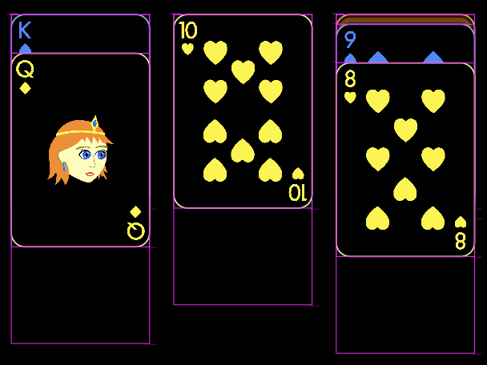

<a id="4-gameplay"></a>

# 4. 게임플레이

이번 장에서는 클론다이크 게임플레이의 핵심을 구현합니다. 즉, 카드가 스톡과 웨이스트, 파일(pile)과
파운데이션 사이를 어떻게 이동하는지를 다룹니다.

하지만 시작하기 전에, 앞 장에서 테이블 위에 흩어 놓은 카드들을 모두 정리합시다.
`KlondikeGame` 클래스를 열고, `onLoad()` 맨 아래에서 테이블에 카드 28장을 추가하던 루프를
지우세요.


<a id="the-piles"></a>

## 파일(pile)

또 하나 필요한 작은 리팩터링은 컴포넌트 이름을 바꾸는 것입니다. `Stock` ⇒ `StockPile`,
`Waste` ⇒ `WastePile`, `Foundation` ⇒ `FoundationPile`, `Pile` ⇒ `TableauPile`로 바꿉니다. 이는
이 컴포넌트들이 카드와의 상호작용을 처리하는 방식에 몇 가지 공통점이 있어서,
모두 공통 API를 구현하도록 하면 편리하기 때문입니다. 이들이 모두 구현할 인터페이스를
`Pile` 클래스라고 부르겠습니다.

```{note}
리팩터링과 아키텍처 변경은 개발 중에 늘 일어납니다.
처음부터 구조를 제대로 잡는 것은 거의 불가능합니다. 예전에 작성한 코드를
바꾸는 것을 두려워하지 마세요. 오히려 좋은
습관입니다.
```

이렇게 이름을 바꾼 뒤에는 각 컴포넌트를 구현하기 시작할 수 있습니다.


<a id="stock-pile"></a>

### 스톡 파일

**스톡**은 게임 화면의 왼쪽 위 모서리에 있는 자리로, 현재 게임에 사용되지 않는 카드를
담고 있습니다. 이 컴포넌트에는 다음 기능을 만들어야 합니다.

1. 현재 게임에 사용되지 않는 카드를 뒷면이 위로 향하게 담아 둘 수 있어야 합니다.
2. 스톡을 탭하면 맨 위의 카드 3장을 뒤집어 **웨이스트** 파일로 옮겨야 합니다.
3. 카드가 다 떨어지면, 이곳이 스톡 파일임을 나타내는 시각적 표시가 있어야 합니다.
4. 카드가 다 떨어졌을 때 빈 스톡을 탭하면 웨이스트 파일의 모든 카드를
    뒷면이 위로 가도록 뒤집어 스톡으로 옮겨야 합니다.

여기서 먼저 결정해야 할 질문은 이것입니다. 누가 `Card` 컴포넌트를 소유할 것인가?
이전에는 카드를 게임 화면에 직접 추가했지만, 이제는 카드가 `Stock` 컴포넌트나
웨이스트, 파일, 파운데이션에 속한다고 하는 편이 더 낫지 않을까요? 이
접근 방식은 솔깃하지만, 카드를 한 곳에서 다른 곳으로 옮겨야 할 때 오히려
일이 더 복잡해질 것이라고 생각합니다.

그래서 처음 방식을 유지하기로 했습니다. `Card` 컴포넌트는
`KlondikeGame` 자체가 직접 소유하고, `StockPile`과 다른 파일들은 단지 현재 어떤 카드가
자신에게 놓여 있는지만 알고 있습니다.

이를 염두에 두고 `StockPile` 컴포넌트를 구현해 봅시다.

```dart
class StockPile extends PositionComponent {
  StockPile({super.position}) : super(size: KlondikeGame.cardSize);

  /// 현재 이 파일에 놓여 있는 카드들입니다. 리스트의 첫 번째 카드가
  /// 맨 아래에 있고, 마지막 카드가 맨 위에 있습니다.
  final List<Card> _cards = [];

  void acquireCard(Card card) {
    assert(!card.isFaceUp);
    card.position = position;
    card.priority = _cards.length;
    _cards.add(card);
  }
}
```

여기서 `acquireCard()` 메서드는 전달받은 카드를 내부 리스트 `_cards`에 저장합니다. 또한
그 카드를 `StockPile`의 위치로 옮기고, 카드들이 올바른 순서로 표시되도록 우선순위를
조정합니다. 하지만 이 메서드는 카드를 `StockPile` 컴포넌트의 자식으로 마운트하지는
않습니다. 카드는 여전히 최상위 게임에 속합니다.

게임 클래스 얘기가 나왔으니, `KlondikeGame`을 열고 52장짜리 카드 한 벌을 만들어
스톡 파일에 올려놓는 다음 줄을 추가합시다(`onLoad` 메서드의 끝에
추가해야 합니다).

```dart
final cards = [
  for (var rank = 1; rank <= 13; rank++)
    for (var suit = 0; suit < 4; suit++)
      Card(rank, suit)
];
world.addAll(cards);
cards.forEach(stock.acquireCard);
```

이것으로 이 섹션 처음에 세운 짧은 계획의 첫 단계가 끝났습니다. 하지만 두 번째
단계를 위해서는 웨이스트 파일이 있어야 하므로, 잠시 옆길로 새서
`WastePile` 클래스를 구현해 봅시다.


<a id="waste-pile"></a>

### 웨이스트 파일

**웨이스트**는 스톡 옆에 있는 파일입니다. 게임을 진행하는 동안 스톡 파일의 맨 위에서
카드를 가져와 웨이스트에 놓게 됩니다. 이 클래스의 기능은
아주 단순합니다. 일정 수의 카드를 앞면이 위로 향하게 담아 두고, 맨 위 3장을 부채꼴로 펼칩니다.

`StockPile` 클래스를 구현할 때와 같은 방식으로 `WastePile` 클래스를 구현해 봅시다. 다만
이번에는 카드가 앞면이 위로 향해 있어야 합니다.

```dart
class WastePile extends PositionComponent {
  WastePile({super.position}) : super(size: KlondikeGame.cardSize);

  final List<Card> _cards = [];

  void acquireCard(Card card) {
    assert(card.isFaceUp);
    card.position = position;
    card.priority = _cards.length;
    _cards.add(card);
  }
}
```

지금까지는 모든 카드를 하나의 가지런한 더미로 쌓지만, 우리가 원한 것은 맨 위 3장을 부채꼴로 펼치는 것이었습니다. 그러니
이를 위한 전용 메서드 `_fanOutTopCards()`를 추가하고, 매번 `acquireCard()`의 끝에서
호출하겠습니다.

```dart
  void _fanOutTopCards() {
    final n = _cards.length;
    for (var i = 0; i < n; i++) {
      _cards[i].position = position;
    }
    if (n == 2) {
      _cards[1].position.add(_fanOffset);
    } else if (n >= 3) {
      _cards[n - 2].position.add(_fanOffset);
      _cards[n - 1].position.addScaled(_fanOffset, 2);
    }
  }
```

여기서 `_fanOffset` 변수는 부채꼴 안에서 카드 사이의 간격을 정하는 데 쓰이며,
카드 너비의 약 20%로 정했습니다.

```dart
  final Vector2 _fanOffset = Vector2(KlondikeGame.cardWidth * 0.2, 0);
```

이제 웨이스트 파일이 준비되었으니 `StockPile`로 돌아갑시다.


<a id="stock-pile----tap-to-deal-cards"></a>

### 스톡 파일 -- 탭해서 카드 나눠 주기

할 일 목록의 두 번째 항목은 게임의 첫 번째 상호작용 기능입니다. 스톡 파일을
탭하면 카드 3장을 웨이스트에 나눠 줍니다.

Flame에서 컴포넌트에 탭 기능을 추가하는 것은 아주 간단합니다. 탭할 수 있게 만들고 싶은
컴포넌트에 `TapCallbacks` 믹스인을 추가하기만 하면 됩니다.

```dart
class StockPile extends PositionComponent with TapCallbacks { ... }
```

아, 그리고 탭이 일어났을 때 어떤 일이 일어나야 하는지도 알려 주어야 합니다. 여기서는 맨 위의 카드 3장을
앞면이 위로 가게 뒤집어 웨이스트 파일로 옮기려고 합니다. 그러니 `StockPile`
클래스에 다음 메서드를 추가하세요.

```dart
  @override
  void onTapUp(TapUpEvent event) {
  final wastePile = parent!.firstChild<WastePile>()!;
    for (var i = 0; i < 3; i++) {
      if (_cards.isNotEmpty) {
        final card = _cards.removeLast();
        card.flip();
        wastePile.acquireCard(card);
      }
    }
  }
```

카드가 한 파일에서 다른 파일로 즉시 이동해서 매우 부자연스러워 보인다는 것을 아마
눈치챘을 것입니다. 하지만 지금은 이대로 두겠습니다. 게임을 더 부드럽게 만드는 일은
튜토리얼의 다음 장으로 미룹니다.

또한 지금은 카드가 킹부터 시작해 에이스로 끝나는, 잘 정해진 순서로 정렬되어 있습니다.
하지만 이러면 게임플레이가 그다지 재미있지 않으니, 다음 줄을

```dart
    cards.shuffle();
```

`KlondikeGame` 클래스에서 카드 리스트를 만든 직후에 추가하세요.


:::{seealso}
탭 기능에 대한 자세한 내용은 [](../../flame/inputs/tap_events.md)를 참고하세요.
:::


<a id="stock-pile----visual-representation"></a>

### 스톡 파일 -- 시각적 표현

현재 스톡 파일에 카드가 없으면 그냥 빈 공간만 보입니다. 이곳이 스톡이라는
시각적 단서가 없습니다. 하지만 이런 단서가 필요합니다. 스톡 파일이 비었을 때 사용자가
그것을 클릭해 웨이스트의 모든 카드를 스톡으로 되돌리고,
다시 나눠 줄 수 있게 하고 싶기 때문입니다.

여기서는 빈 스톡 파일에 카드 모양의 테두리와 가운데의 원을 표시하겠습니다.

```dart
  @override
  void render(Canvas canvas) {
    canvas.drawRRect(KlondikeGame.cardRRect, _borderPaint);
    canvas.drawCircle(
      Offset(width / 2, height / 2),
      KlondikeGame.cardWidth * 0.3,
      _circlePaint,
    );
  }
```

여기서 paint는 다음과 같이 정의하고,

```dart
  final _borderPaint = Paint()
    ..style = PaintingStyle.stroke
    ..strokeWidth = 10
    ..color = const Color(0xFF3F5B5D);
  final _circlePaint = Paint()
    ..style = PaintingStyle.stroke
    ..strokeWidth = 100
    ..color = const Color(0x883F5B5D);
```

`KlondikeGame` 클래스의 `cardRRect`는 다음과 같이 정의합니다.

```dart
  static final cardRRect = RRect.fromRectAndRadius(
    const Rect.fromLTWH(0, 0, cardWidth, cardHeight),
    const Radius.circular(cardRadius),
  );
```

이제 스톡 파일을 끝까지 클릭해 넘기면 스톡 카드 자리를 나타내는 플레이스홀더를
볼 수 있습니다.


<a id="stock-pile----refill-from-the-waste"></a>

### 스톡 파일 -- 웨이스트에서 다시 채우기

추가할 마지막 기능은 사용자가 빈 스톡을 탭했을 때 웨이스트 파일의 카드를 스톡
파일로 되돌리는 것입니다. 이를 구현하기 위해 `onTapUp()` 메서드를
다음과 같이 수정합니다.

```dart
  @override
  void onTapUp(TapUpEvent event) {
    final wastePile = parent!.firstChild<WastePile>()!;
    if (_cards.isEmpty) {
      wastePile.removeAllCards().reversed.forEach((card) {
        card.flip();
        acquireCard(card);
      });
    } else {
      for (var i = 0; i < 3; i++) {
        if (_cards.isNotEmpty) {
          final card = _cards.removeLast();
          card.flip();
          wastePile.acquireCard(card);
        }
      }
    }
  }
```

웨이스트 파일에서 꺼낸 카드 리스트를 왜 뒤집어야 했는지 궁금하다면, 그 이유는
각 카드를 제자리에서 하나씩 뒤집는 것이 아니라 웨이스트 파일 전체를 한 번에 뒤집는 것을
흉내 내고 싶기 때문입니다. 스톡 파일을 다시 넘길 때마다 카드가 처음과 같은 순서로
나눠지는지 확인하면 의도한 대로 동작하는지
검증할 수 있습니다.

하지만 `WastePile.removeAllCards()` 메서드는 아직 구현해야 합니다.

```dart
  List<Card> removeAllCards() {
    final cards = _cards.toList();
    _cards.clear();
    return cards;
  }
```

이것으로 `StockPile` 기능은 거의 마무리되었고, `WastePile`도 이미 구현했습니다.
따라서 남은 컴포넌트는 `FoundationPile`과 `TableauPile` 두 개뿐입니다. 더 간단해 보이는
첫 번째 것부터 시작하겠습니다.


<a id="foundation-piles"></a>

### 파운데이션 파일

**파운데이션** 파일은 게임 오른쪽 위 모서리에 있는 네 개의 파일입니다. 이곳에서
에이스부터 킹까지 순서대로 카드를 쌓아 나갑니다. 이 클래스의 기능은
`StockPile`, `WastePile`과 비슷합니다. 카드를 앞면이 위로 향하게 담아 둘 수 있어야 하고,
카드가 없을 때 파운데이션이 어디인지 보여 주는 시각적 표시가 있어야 합니다.

먼저 카드를 담는 로직을 구현해 봅시다.

```dart
class FoundationPile extends PositionComponent {
  FoundationPile({super.position}) : super(size: KlondikeGame.cardSize);

  final List<Card> _cards = [];

  void acquireCard(Card card) {
    assert(card.isFaceUp);
    card.position = position;
    card.priority = _cards.length;
    _cards.add(card);
  }
}
```

파운데이션의 시각적 표현으로는 그 파운데이션의 무늬를 회색의 큰 아이콘으로
표시하기로 했습니다. 따라서 클래스 정의에 무늬 정보를 포함하도록
수정해야 합니다.

```dart
class FoundationPile extends PositionComponent {
  FoundationPile(int intSuit, {super.position})
      : suit = Suit.fromInt(intSuit),
        super(size: KlondikeGame.cardSize);

  final Suit suit;
  ...
}
```

`KlondikeGame` 클래스에서 파운데이션을 생성하는 코드도 각 파운데이션에 무늬 인덱스를
전달하도록 그에 맞게 수정해야 합니다.

이제 파운데이션 파일의 렌더링 코드는 다음과 같습니다.

```dart
  @override
  void render(Canvas canvas) {
    canvas.drawRRect(KlondikeGame.cardRRect, _borderPaint);
    suit.sprite.render(
      canvas,
      position: size / 2,
      anchor: Anchor.center,
      size: Vector2.all(KlondikeGame.cardWidth * 0.6),
      overridePaint: _suitPaint,
    );
  }
```

여기서는 paint 객체가 두 개 필요합니다. 하나는 테두리용이고, 하나는 무늬용입니다.

```dart
  final _borderPaint = Paint()
    ..style = PaintingStyle.stroke
    ..strokeWidth = 10
    ..color = const Color(0x50ffffff);
  late final _suitPaint = Paint()
    ..color = suit.isRed? const Color(0x3a000000) : const Color(0x64000000)
    ..blendMode = BlendMode.luminosity;
```

무늬 paint는 `BlendMode.luminosity`를 사용해 무늬 스프라이트의 원래 노랑/파랑 색을
회색조로 변환합니다. paint의 "색"이 무늬가 빨간색인지 검은색인지에 따라 다른 이유는
그 스프라이트들의 원래 휘도가 다르기 때문입니다. 그래서 회색조에서 같아 보이도록
서로 다른 두 가지 색을 골라야 했습니다.


<a id="tableau-piles"></a>

### 태블로 파일

구현해야 할 게임의 마지막 부분은 `TableauPile` 컴포넌트입니다. 이 파일은
모두 일곱 개이며, 게임플레이의 대부분이 이곳에서 일어납니다.

`TableauPile`에도 시각적 표현이 필요합니다. 비어 있을 때 킹을 놓을 수 있는
자리라는 것을 나타내기 위해서입니다. 빈 테두리 하나면 충분할 것
같습니다.

```dart
class TableauPile extends PositionComponent {
  TableauPile({super.position}) : super(size: KlondikeGame.cardSize);

  final _borderPaint = Paint()
    ..style = PaintingStyle.stroke
    ..strokeWidth = 10
    ..color = const Color(0x50ffffff);

  @override
  void render(Canvas canvas) {
    canvas.drawRRect(KlondikeGame.cardRRect, _borderPaint);
  }
}
```

아, 그리고 당연히 이 클래스도 카드를 담을 수 있어야 합니다. 여기서는 일부 카드는
뒷면이 위로, 나머지는 앞면이 위로 향해 있습니다. 또한 `WastePile` 컴포넌트에서 했던 것과
비슷하게, 세로 방향으로 약간 펼쳐 놓아야 합니다.

```dart
  /// 현재 이 파일에 놓여 있는 카드들입니다.
  final List<Card> _cards = [];
  final Vector2 _fanOffset = Vector2(0, KlondikeGame.cardHeight * 0.05);

  void acquireCard(Card card) {
    if (_cards.isEmpty) {
      card.position = position;
    } else {
      card.position = _cards.last.position + _fanOffset;
    }
    card.priority = _cards.length;
    _cards.add(card);
  }
```

이제 남은 일은 `KlondikeGame`으로 가서 게임이 시작될 때 카드가 `TableauPile`들에
나눠지도록 하는 것뿐입니다. `onLoad()` 메서드 끝부분의 코드를
다음과 같이 수정하세요.

```dart
  @override
  Future<void> onLoad() async {
    ...

    final cards = [
      for (var rank = 1; rank <= 13; rank++)
        for (var suit = 0; suit < 4; suit++)
          Card(rank, suit)
    ];
    cards.shuffle();
    world.addAll(cards);

    int cardToDeal = cards.length - 1;
    for (var i = 0; i < 7; i++) {
      for (var j = i; j < 7; j++) {
        piles[j].acquireCard(cards[cardToDeal--]);
      }
      piles[i].flipTopCard();
    }
    for(int n = 0; n <= cardToDeal; n++) {
      stock.acquireCard(cards[n]);
    }
  }
```

덱에서 카드를 한 장씩 나눠 `TableauPile`들에 놓고, 그런 다음에야
남은 카드를 스톡에 넣는다는 점에 주목하세요.

앞에서 모든 카드를 `KlondikeGame` 자체가 소유하기로 했던 것을 떠올려 보세요. 그래서
카드들은 `cards`라는 생성된 List 구조에 담기고, 섞인 다음 `world`에 추가됩니다. 이
List에는 항상 52장의 카드가 들어 있어야 하므로, 감소하는 인덱스 `cardToDeal`을 사용해 덱의 맨 위에서
카드 28장을 한 장씩 파일들에 나눠 주고, 파일들은 덱에 있는 카드의 참조를 얻습니다.
증가하는 인덱스는 남은 24장을 올바르게 섞인 순서대로 스톡에 나눠 주는 데 사용합니다.
나눠 주기가 끝난 뒤에도 `cards` 리스트에는 여전히 52개의 `Card` 객체가 있습니다. 카드 파일에서는
파일에서 카드를 꺼낼 때 `removeList()`를 사용했지만, 여기서는 사용하지 않습니다. 그렇게 하면
`KlondikeGame`의 소유에서 카드가 제거되기 때문입니다.

`TableauPile` 클래스의 `flipTopCard` 메서드는 이름 그대로 아주 간단합니다.

```dart
  void flipTopCard() {
    assert(_cards.last.isFaceDown);
    _cards.last.flip();
  }
```

이 시점에서 게임을 실행하면 보기 좋게 배치되어 바로 플레이할 수 있을 것처럼 보입니다.
다만 아직 카드를 움직일 수 없는데, 이건 꽤 치명적인 문제입니다. 그러니 더 지체하지 않고
다음 섹션을 소개합니다.


<a id="moving-the-cards"></a>

## 카드 옮기기

카드를 옮기는 것은 지금까지 다룬 것보다 조금 더 복잡한 주제입니다. 이를
몇 개의 작은 단계로 나누겠습니다.

1. 간단한 이동: 카드를 잡고 이리저리 움직입니다.
2. 사용자가 옮기도록 허용된 카드만 옮길 수 있게 합니다.
3. 카드가 올바른 목적지에 놓이는지 확인합니다.
4. 연속된 카드 묶음을 드래그합니다.


<a id="1-simple-movement"></a>

### 1. 간단한 이동

화면에서 카드를 드래그할 수 있게 하려고 합니다. 이는 `StockPile`을 탭할 수 있게
만드는 것보다도 간단합니다. `Card` 클래스로 가서 `DragCallbacks` 믹스인을 추가하기만 하면 됩니다.

```dart
class Card extends PositionComponent with DragCallbacks {
}
```

다음 단계는 실제 드래그 이벤트 콜백인 `onDragStart`, `onDragUpdate`,
`onDragEnd`를 구현하는 것입니다.

드래그 제스처가 시작되면 가장 먼저 카드의 우선순위를 높여서
다른 모든 카드보다 위에 렌더링되도록 해야 합니다. 그렇지 않으면 카드가 가끔
다른 카드 "아래로 미끄러져 들어가" 매우 부자연스러워 보입니다.

```dart
  @override
  void onDragStart(DragStartEvent event) {
    priority = 100;
  }
```

드래그하는 동안 `onDragUpdate` 이벤트가 계속 호출됩니다. 이 콜백을 사용해
카드가 손가락(또는 마우스)의 움직임을 따라가도록 카드 위치를 업데이트합니다.
이 콜백에 전달되는 `event` 객체에는 가장 최근의 터치 지점 좌표와
`localDelta` 속성이 들어 있습니다. `localDelta`는 카메라 줌을 고려한,
이전 `onDragUpdate` 호출 이후의 변위 벡터입니다.

```dart
  @override
  void onDragUpdate(DragUpdateEvent event) {
    position += event.localDelta;
  }
```

지금까지는 아무 카드나 잡아서 테이블 어디로든 드래그할 수 있습니다. 하지만 우리가
원하는 것은 카드가 갈 수 있는 곳과 갈 수 없는 곳을 제한하는 것입니다. 바로 여기서
게임 로직의 핵심이 시작됩니다.


<a id="2-move-only-allowed-cards"></a>

### 2. 허용된 카드만 옮기기

첫 번째 제약은 사용자가 우리가 허용한 카드만 드래그할 수 있어야 한다는 것입니다.
허용되는 카드는 (1) 웨이스트 파일의 맨 위 카드, (2) 파운데이션 파일의 맨 위 카드,
(3) 태블로 파일에서 앞면이 위로 향한 모든 카드입니다.

따라서 카드를 옮길 수 있는지 판단하려면 카드가 현재 어느 파일에 속해 있는지
알아야 합니다. 여러 방법이 있겠지만, 가장
간단해 보이는 방법은 모든 카드가 자신이 현재 놓인 파일에 대한 참조를 갖게 하는 것입니다.

그럼 기존의 모든 파일이 구현할 추상 인터페이스 `Pile`을
정의하는 것부터 시작합시다.

```dart
abstract class Pile {
  bool canMoveCard(Card card);
}
```

이 클래스는 나중에 더 확장하겠지만, 지금은 `StockPile`, `WastePile`,
`FoundationPile`, `TableauPile` 각 클래스가 이 인터페이스를 구현한다고
표시해 둡시다.

```dart
class StockPile extends PositionComponent with TapCallbacks implements Pile {
  ...
  @override
  bool canMoveCard(Card card) => false;
}

class WastePile extends PositionComponent implements Pile {
  ...
  @override
  bool canMoveCard(Card card) => _cards.isNotEmpty && card == _cards.last;
}

class FoundationPile extends PositionComponent implements Pile {
  ...
  @override
  bool canMoveCard(Card card) => _cards.isNotEmpty && card == _cards.last;
}

class TableauPile extends PositionComponent implements Pile {
  ...
  @override
  bool canMoveCard(Card card) => _cards.isNotEmpty && card == _cards.last;
}
```

또한 모든 `Card`가 현재 어느 파일에 있는지 알게 하고 싶었습니다. 이를 위해
`Card` 클래스에 `Pile? pile` 필드를 추가하고, 각 파일의 `acquireCard()` 메서드에서
다음과 같이 이 필드를 설정하세요.

```dart
  void acquireCard(Card card) {
    ...
    card.pile = this;
  }
```

이제 이 새 기능을 활용할 수 있습니다. `Card.onDragStart()` 메서드로 가서
드래그를 시작하기 전에 카드를 옮길 수 있는지 확인하도록 수정하세요.

```dart
  void onDragStart(DragStartEvent event) {
    if (pile?.canMoveCard(this) ?? false) {
      super.onDragStart(event);
      priority = 100;
    }
  }
```

`super.onDragStart()` 호출도 추가했는데, 이는 `DragCallbacks` 믹스인의 `_isDragged` 변수를
`true`로 설정합니다. `onDragUpdate()` 메서드에서는 public `isDragged` getter로 이 플래그를
확인해야 하고, `onDragEnd()`에서는 `super.onDragEnd()`를 사용해 플래그가 다시
`false`로 설정되게 해야 합니다.

```dart
  @override
  void onDragUpdate(DragUpdateEvent event) {
    if (!isDragged) {
      return;
    }
    position += event.localDelta;
  }

  @override
  void onDragEnd(DragEndEvent event) {
    super.onDragEnd(event);
  }
```

이제 올바른 카드만 드래그할 수 있지만, 여전히 테이블의 아무 위치에나 놓이므로
이 부분을 작업해 봅시다.


<a id="3-dropping-the-cards-at-proper-locations"></a>

### 3. 카드를 올바른 위치에 놓기

이 시점에서 하고 싶은 것은 드래그한 카드가 어디에 놓이는지 알아내는 것입니다. 더
구체적으로는 어느 *파일*에 놓이는지 알고 싶습니다. 이는
`componentsAtPoint()` API를 사용하면 됩니다. 이 API로 화면의 특정 위치에
어떤 컴포넌트가 있는지 조회할 수 있습니다.

그래서 `onDragEnd` 콜백을 수정한 첫 번째 시도는 다음과 같습니다.

```dart
  @override
  void onDragEnd(DragEndEvent event) {
    if (!isDragged) {
      return;
    }
    super.onDragEnd(event);
    final dropPiles = parent!
        .componentsAtPoint(position + size / 2)
        .whereType<Pile>()
        .toList();
    if (dropPiles.isNotEmpty) {
      // if (카드를 이 파일에 놓을 수 있다면) {
      //   현재 파일에서 카드를 제거합니다
      //   새 파일에 카드를 추가합니다
      // }
    }
    // 카드를 원래 있던 자리로 되돌립니다
  }
```

여기에는 아직 구현해야 할 기능에 대한 플레이스홀더가 몇 개 남아 있으니,
하나씩 구현해 봅시다.

퍼즐의 첫 번째 조각은 "카드를 여기에 놓을 수 있는가?" 검사입니다. 이를 구현하려면
먼저 `Pile` 클래스로 가서 `canAcceptCard()` 추상 메서드를 추가하세요.

```dart
abstract class Pile {
  ...
  bool canAcceptCard(Card card);
}
```

당연히 이제 모든 `Pile` 하위 클래스에서 이를 구현해야 하니, 구현해 봅시다.

```dart
class FoundationPile ... implements Pile {
  ...
  @override
  bool canAcceptCard(Card card) {
    final topCardRank = _cards.isEmpty? 0 : _cards.last.rank.value;
    return card.suit == suit && card.rank.value == topCardRank + 1;
  }
}

class TableauPile ... implements Pile {
  ...
  @override
  bool canAcceptCard(Card card) {
    if (_cards.isEmpty) {
      return card.rank.value == 13;
    } else {
      final topCard = _cards.last;
      return card.suit.isRed == !topCard.suit.isRed &&
          card.rank.value == topCard.rank.value - 1;
    }
  }
}
```

(`StockPile`과 `WastePile`에서는 이 메서드가 그냥 false를 반환해야 합니다. 그곳에는 어떤 카드도
놓여서는 안 되기 때문입니다.)

좋습니다, 다음 부분은 "현재 파일에서 카드를 제거"하는 것입니다. 다시 한번
`Pile` 클래스로 가서 `removeCard()` 추상 메서드를 추가합시다.

```dart
abstract class Pile {
  ...
  void removeCard(Card card);
}
```

그런 다음 네 개의 파일 하위 클래스를 모두 다시 찾아가 이 메서드를 구현해야 합니다.

```dart
class StockPile ... implements Pile {
  ...
  @override
  void removeCard(Card card) => throw StateError('cannot remove cards from here');
}

class WastePile ... implements Pile {
  ...
  @override
  void removeCard(Card card) {
    assert(canMoveCard(card));
    _cards.removeLast();
    _fanOutTopCards();
  }
}

class FoundationPile ... implements Pile {
  ...
  @override
  void removeCard(Card card) {
    assert(canMoveCard(card));
    _cards.removeLast();
  }
}

class TableauPile ... implements Pile {
  ...
  @override
  void removeCard(Card card) {
    assert(_cards.contains(card) && card.isFaceUp);
    final index = _cards.indexOf(card);
    _cards.removeRange(index, _cards.length);
    if (_cards.isNotEmpty && _cards.last.isFaceDown) {
      flipTopCard();
    }
  }
}
```

의사 코드의 다음 동작은 "새 파일에 카드를 추가"하는 것입니다. 하지만 이것은 이미
구현했습니다. 바로 `acquireCard()` 메서드입니다. 그러니 `Pile`
인터페이스에 선언하기만 하면 됩니다.

```dart
abstract class Pile {
  ...
  void acquireCard(Card card);
}
```

마지막으로 빠진 조각은 "카드를 원래 자리로 되돌리기"입니다. 이것을 어떻게 할지는
아마 짐작할 수 있을 것입니다. `Pile` 인터페이스에 `returnCard()` 메서드를 추가하고,
네 개의 파일 하위 클래스 모두에서 이 메서드를 구현합니다.

```dart
class StockPile ... implements Pile {
  ...
  @override
  void returnCard(Card card) => throw StateError('cannot remove cards from here');
}

class WastePile ... implements Pile {
  ...
  @override
  void returnCard(Card card) {
    card.priority = _cards.indexOf(card);
    _fanOutTopCards();
  }
}

class FoundationPile ... implements Pile {
  ...
  @override
  void returnCard(Card card) {
    card.position = position;
    card.priority = _cards.indexOf(card);
  }
}

class TableauPile ... implements Pile {
  ...
  @override
  void returnCard(Card card) {
    final index = _cards.indexOf(card);
    card.position =
        index == 0 ? position : _cards[index - 1].position + _fanOffset;
    card.priority = index;
  }
}
```

이제 이 모든 것을 합치면 `Card`의 `onDragEnd` 메서드는 다음과 같습니다.

```dart
  @override
  void onDragEnd(DragEndEvent event) {
    if (!isDragged) {
      return;
    }
    super.onDragEnd(event);
    final dropPiles = parent!
        .componentsAtPoint(position + size / 2)
        .whereType<Pile>()
        .toList();
    if (dropPiles.isNotEmpty) {
      if (dropPiles.first.canAcceptCard(this)) {
        pile!.removeCard(this);
        dropPiles.first.acquireCard(this);
        return;
      }
    }
    pile!.returnCard(this);
  }
```

자, 꽤 많은 작업이었습니다. 하지만 지금 게임을 실행하면 카드를 한 파일에서 다른 파일로
제대로 옮길 수 있고, 카드가 가서는 안 되는 곳으로 가는 일은 절대 없을 것입니다.
남은 것은 태블로 파일 사이에서 여러 장의 카드를 한 번에 옮길 수 있게 하는 것뿐입니다. 그러니
잠깐 쉬었다가 다음 섹션으로 넘어갑시다!


<a id="4-moving-a-run-of-cards"></a>

### 4. 연속된 카드 묶음 옮기기

이 섹션에서는 태블로 파일 사이에서 작은 카드 더미를 옮길 수 있도록 필요한 변경을
구현합니다. 하지만 시작하기 전에 작은 수정부터 해야 합니다.

앞 섹션에서 게임을 실행하면서, 태블로 파일의 카드들이 너무 촘촘하게 붙어 있다는 것을
아마 눈치챘을 것입니다. 즉, 뒷면이 위로 향한 카드는 적절한 간격에 있지만,
앞면이 위로 향한 카드는 더 넓은 간격을 두어야 하는데 현재는 그렇지 않습니다.
이 때문에 어떤 카드를 드래그할 수 있는지 알아보기가 정말 어렵습니다.

그러니 `TableauPile` 클래스로 가서 새 메서드 `layOutCards()`를 만듭시다. 이 메서드의 역할은
현재 파일에 있는 모든 카드가 올바른 위치에 있도록 하는 것입니다.

```dart
  final Vector2 _fanOffset1 = Vector2(0, KlondikeGame.cardHeight * 0.05);
  final Vector2 _fanOffset2 = Vector2(0, KlondikeGame.cardHeight * 0.20);

  void layOutCards() {
    if (_cards.isEmpty) {
      return;
    }
    _cards[0].position.setFrom(position);
    for (var i = 1; i < _cards.length; i++) {
      _cards[i].position
        ..setFrom(_cards[i - 1].position)
        ..add(_cards[i - 1].isFaceDown ? _fanOffset1 : _fanOffset2);
    }
  }
```

`removeCard()`, `returnCard()`, `acquireCard()`의 끝에서 이 메서드를 호출하고,
카드 위치를 처리하던 기존 로직은 모두 이것으로 대체하세요.

눈치챘을 수 있는 또 다른 문제는 카드 더미가 높아질수록 그곳에 카드를 놓기가
어려워진다는 것입니다. 카드가 어느 파일에 놓이는지 판단하는 로직이 카드의 중심이
`TableauPile` 컴포넌트 중 하나의 안에 있는지를 검사하는데, 그 컴포넌트들의
크기가 카드 한 장 크기뿐이기 때문입니다! 이 불일치를 고치려면 태블로 파일의 높이가
그 안의 모든 카드를 합친 높이 이상, 또는 그보다 더 높다고 선언하기만 하면 됩니다.
`layOutCards()` 메서드 끝에 다음 줄을 추가하세요.

```dart
    height = KlondikeGame.cardHeight * 1.5 + _cards.last.y - _cards.first.y;
```

여기서 `1.5`라는 계수는 각 파일의 아래쪽에 약간의 여유 공간을 더해 줍니다. 놓으려는 카드는
너비와 높이의 절반을 조금 넘게 히트박스와 겹쳐야 합니다. 아래쪽에서
다가간다면 가장 가까운 카드(즉, 완전히 보이는 카드)와만 겹치게 됩니다.
히트박스를 보려면 잠시 디버그 모드를 켜 보세요.



좋습니다, 이제 본론으로 들어갑시다. 카드 더미를 한 번에 옮기는 방법입니다.

가장 먼저 추가할 것은 모든 카드의 `attachedCards` 리스트입니다. 이 리스트는
카드 위에 다른 카드가 있는 상태로 드래그될 때에만 비어 있지 않습니다. `Card` 클래스에 다음
선언을 추가하세요.

```dart
  final List<Card> attachedCards = [];
```

이제 `onDragStart`에서 이 리스트를 만들려면, 주어진 카드 위에 있는 카드 목록을
`TableauPile`에 조회해야 합니다. `TableauPile` 클래스에 그런 메서드를 추가합시다.

```dart
  List<Card> cardsOnTop(Card card) {
    assert(card.isFaceUp && _cards.contains(card));
    final index = _cards.indexOf(card);
    return _cards.getRange(index + 1, _cards.length).toList();
  }
```

`TableauPile` 클래스에 있는 김에, 반드시 맨 위에 있지 않은 카드도 드래그할 수 있도록
`canMoveCard()` 메서드도 업데이트합시다.

```dart
  @override
  bool canMoveCard(Card card) => card.isFaceUp;
```

`Card` 클래스로 돌아와서, 카드가 움직이기 시작할 때 이 메서드를 사용해
`attachedCards` 리스트를 채울 수 있습니다.

```dart
  @override
  void onDragStart(DragStartEvent event) {
    if (pile?.canMoveCard(this) ?? false) {
      super.onDragStart();
      priority = 100;
      if (pile is TableauPile) {
        attachedCards.clear();
        final extraCards = (pile! as TableauPile).cardsOnTop(this);
        for (final card in extraCards) {
          card.priority = attachedCards.length + 101;
          attachedCards.add(card);
        }
      }
    }
  }
```

이제 `onDragUpdate` 메서드에서 붙어 있는 카드들도 메인 카드와 함께 움직이도록
하기만 하면 됩니다.

```dart
  @override
  void onDragUpdate(DragUpdateEvent event) {
    if (!isDragged) {
      return;
    }
    final delta = event.localDelta;
    position.add(delta);
    attachedCards.forEach((card) => card.position.add(delta));
  }
```

거의 다 됐습니다. 남은 것은 자잘한 마무리뿐입니다. 예를 들어 사용자가
카드 더미를 파운데이션 파일에 놓지 못하게 하고 싶으니,
`FoundationPile` 클래스로 가서 `canAcceptCard()` 메서드를 그에 맞게 수정합시다.

```dart
  @override
  bool canAcceptCard(Card card) {
    final topCardRank = _cards.isEmpty ? 0 : _cards.last.rank.value;
    return card.suit == suit &&
        card.rank.value == topCardRank + 1 &&
        card.attachedCards.isEmpty;
  }
```

둘째로, 카드 더미가 태블로 파일에 놓일 때 이를 제대로 처리해야 합니다.
그러니 `Card` 클래스로 돌아가 `onDragEnd()` 메서드가 붙어 있는 카드들도
파일로 옮기도록 업데이트하고, 카드를 원래 파일로 되돌릴 때도 마찬가지로 처리하세요.

```dart
  @override
  void onDragEnd(DragEndEvent event) {
    if (!isDragged) {
      return;
    }
    super.onDragEnd(event);
    final dropPiles = parent!
        .componentsAtPoint(position + size / 2)
        .whereType<Pile>()
        .toList();
    if (dropPiles.isNotEmpty) {
      if (dropPiles.first.canAcceptCard(this)) {
        pile!.removeCard(this);
        dropPiles.first.acquireCard(this);
        if (attachedCards.isNotEmpty) {
          attachedCards.forEach((card) => dropPiles.first.acquireCard(card));
          attachedCards.clear();
        }
        return;
      }
    }
    pile!.returnCard(this);
    if (attachedCards.isNotEmpty) {
      attachedCards.forEach((card) => pile!.returnCard(card));
      attachedCards.clear();
    }
  }
```

처리해야 할 경우가 하나 더 있습니다. 드래그는 끝나는 대신 *취소*될 수도 있습니다. 예를 들어
플레이어가 화면에 두 번째 손가락을 올려 제스처가 핀치로 바뀌는 경우입니다. Flame은
취소를 `onDragEnd` 이벤트로 바꿔 주지 않으므로, 이를 처리하지 않으면 카드가
테이블 한가운데에 떠 있는 채로 남게 됩니다. 여기서는 단순히 카드가 현재 위치에
놓인 것처럼 처리합니다.

```dart
  @override
  void onDragCancel(DragCancelEvent event) {
    super.onDragCancel(event);
    onDragEnd(event.toDragEnd());
  }
```

자, 이것으로 끝입니다! 이제 게임을 완전히 플레이할 수 있습니다. 아래 버튼을 눌러 완성된
코드를 보거나 직접 플레이해 보세요. 다음 섹션에서는 이펙트를 활용해 게임에 더 많은
애니메이션을 넣는 방법을 알아봅니다.

```{flutter-app}
:sources: ../tutorials/klondike/app
:page: step4
:show: popup code
```
