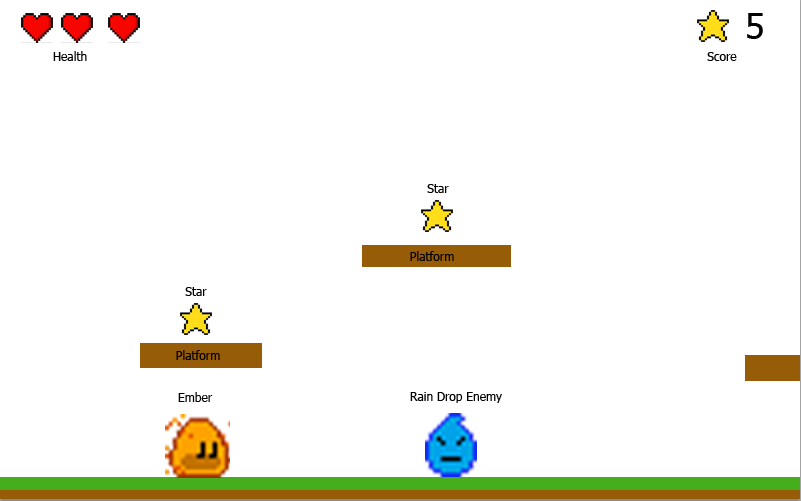
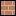
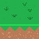

<a id="1-preparation"></a>

# 1. 준비

어떤 종류의 게임 프로젝트든 시작하기 전에 무엇을 만들고 싶은지 아이디어가 있어야 하고, 저는 그다음에
**이름**을 붙이는 것을 좋아합니다. 이 튜토리얼과 게임에서 Ember는 (GitHub) 별을 최대한 많이 모으는
모험을 떠나게 되며, 게임 이름은 `Ember Quest`라고 하겠습니다.

이제 시작할 시간입니다. 하지만 먼저 [빈 Flame 게임
튜토리얼](../bare_flame_game.md)로 가서 필요한 설정 단계를 마쳐야 합니다. 돌아오면
다음 내용을 가진 `main.dart` 파일이 이미 있을 것입니다.

```dart
import 'package:flame/game.dart';
import 'package:flutter/widgets.dart';

void main() {
  final game = FlameGame();
  runApp(GameWidget(game: game));
}
```


<a id="planning"></a>

## 계획

[klondike](../klondike/klondike.md) 튜토리얼에서와 마찬가지로, 새 게임을 시작하는 것은 막막하게 느껴질 수 있습니다.
저는 먼저 어떤 플랫폼을 대상으로 할지 정하는 것을 좋아합니다. 모바일 게임일까요, 데스크톱
게임일까요, 아니면 웹 게임일까요? Flutter와 Flame이라면 모두 가능합니다. 하지만 이 게임에서는
웹 게임에 집중하겠습니다. 즉, 사용자는 키보드를 사용해 게임과 상호작용하게 됩니다.

간단한 스케치로 시작하는 것(제 스케치는 매우 대충 그렸듯이 완벽할 필요는 없습니다)이
무엇을 구현해야 하는지 파악하는 가장 좋은 방법입니다. 아래 스케치를 보면
다음이 필요하다는 것을 알 수 있습니다.

- Player 클래스
- Enemy 클래스
- Star 클래스
- Platform 클래스
- Ground 클래스
- HUD 클래스 (체력과 모은 별)



이 모든 것은 `FlameGame`을 상속한 `EmberQuestGame`에서 하나로 합쳐집니다.


<a id="assets"></a>

## 에셋

모든 게임에는 에셋이 필요합니다. 에셋이란 이미지, 스프라이트, 애니메이션, 사운드 등을 말합니다. 저는
아티스트가 아니지만, 이 게임은 Flame 마스코트인 Ember를 바탕으로 하고 Ember는 이미 디자인되어 있으므로,
자연스럽게 픽셀 아트 게임이 됩니다. 게임에 사용할 수 있는 무료 픽셀 아트를 제공하는 사이트가
많이 있지만, 반드시 라이선스를 확인하고 준수하며 항상 올바르게 제작자를 표기하세요. 하지만 이 게임에서는
한번 도전해 보는 셈 치고 온라인 픽셀 아트 도구를 사용해 직접 아트워크를 만들겠습니다. 이 도구를 사용하기로
했다면 기본 조작과 에셋 내보내기를 도와주는 온라인 튜토리얼이 여럿 있습니다. 보통
대부분의 게임은 스프라이트 시트를 활용합니다. 스프라이트 시트는 많은 이미지를 하나의 큰 이미지로 합친 것으로,
이를 나누어 개별 이미지로 사용할 수 있습니다. 하지만 이 튜토리얼에서는 Flame 엔진의 캐싱 기능을
보여 주기 위해 일부러 이미지를 개별적으로 저장하겠습니다. 다만 Ember와
물 적(water enemy)은 애니메이션을 만들기 위해 여러 이미지를 담고 있으므로 스프라이트 시트입니다.

아래 이미지를 마우스 오른쪽 버튼으로 클릭하고 "다른 이름으로 저장..."을 선택해 프로젝트의 `assets/images` 폴더에
저장합니다. 이 시점에서 프로젝트 구조는 다음과 같습니다.

```text
emberquest/
 ├─assets/
 │  └─images/
 │     ├─block.png
 │     ├─ember.png
 │     ├─ground.png
 │     ├─heart_half.png
 │     ├─heart.png
 │     ├─star.png
 │     └─water_enemy.png
 ├─lib/
 │  └─main.dart
 └─pubspec.yaml
```






```{note}
이미지 크기가 왜 제각각인지 궁금할 수 있습니다.

온라인 도구로 에셋을 만들면서 16x16 블록 안에서는 게임에 원하는 만큼의
디테일을 표현하기 어려웠습니다. 하트는 32x32에서 괜찮게 나왔고
땅과 별은 64x64로 만들었습니다. 어쨌든 필요에 따라 크기를 조정할 것이므로
에셋 크기는 게임에 영향을 주지 않습니다.
```

또한 이 이미지들을 Flutter에 알려 주어야 합니다(`assets` 폴더 안에 두는 것만으로는
충분하지 않습니다). 이를 위해 `pubspec.yaml` 파일에 다음 줄을 추가합시다.

```yaml
flutter:
  assets:
    - assets/images/
```

자, 준비는 이 정도면 충분합니다. 이제 코딩하러 갑시다!
