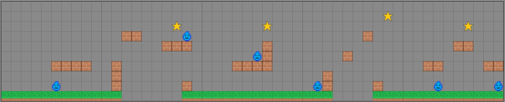
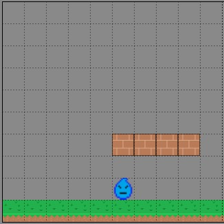
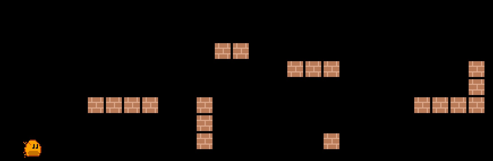

<a id="3-building-the-world"></a>

# 3. 월드 만들기


<a id="creating-segments"></a>

## 세그먼트 만들기

이 월드를 무한하게 만들려면, 반복해서 다시 로드할 수 있는 세그먼트를 만드는 것이 가장 좋은 방법입니다.
이를 위해 레벨 세그먼트가 어떻게 생겼는지 대략적인 스케치가 필요합니다. 세그먼트가 어떤 모습이고
어떻게 반복될 수 있는지 보여 주기 위해 다음 스케치를 만들었습니다.



각 세그먼트는 10x10 격자이고 각 블록은 64픽셀 x 64픽셀입니다. 즉, Ember Quest는
높이가 640이고 너비는 무한합니다. 제 디자인에서는 항상 시작과 끝에 땅(ground)
블록이 있어야 합니다. 또한 세그먼트가 다른 세그먼트로 이어지는 경우를 포함해, 적 앞에는 최소 3개의 땅 블록이
있어야 합니다. 적이 3블록 구간을 왔다 갔다 하도록 할 계획이기 때문입니다. 이제 세그먼트에 대한 계획이 섰으니,
세그먼트 매니저 클래스를 만들어 봅시다.


<a id="segment-manager"></a>

### 세그먼트 매니저

시작하려면 세그먼트 매니저에서 블록들을 참조하게 된다는 것을 이해해야 합니다.
그러니 먼저 `lib/objects`라는 새 폴더를 만듭니다. 그 폴더 안에 `ground_block.dart`,
`platform_block.dart`, `star.dart`라는 3개의 파일을 만듭니다. 이 파일들에는 클래스의 기본
보일러플레이트 코드만 있으면 되므로, 각 파일에 다음을 작성합니다.

```dart
class GroundBlock {}

class PlatformBlock {}

class Star {}
```

또한 `lib/actors` 폴더에 다음 보일러플레이트 코드로 `water_enemy.dart`를 만듭니다.

```dart
class WaterEnemy {}
```

이제 `lib/managers`라는 새 폴더에 `segment_manager.dart` 파일을 만들 수 있습니다.
세그먼트 매니저는 말하자면 Ember Quest의 심장이자 영혼입니다. 여기서는
원하는 만큼 창의력을 발휘할 수 있습니다. 제 디자인을 따를 필요는 없으며, 무엇을 디자인하든
세그먼트가 위에서 설명한 규칙을 따라야 한다는 것만 기억하세요. `segment_manager.dart`에
다음 코드를 추가합니다.

```dart
class Block {
  // gridPosition 위치는 항상 세그먼트 기준의 X,Y입니다.
  // 0,0은 왼쪽 아래 모서리입니다.
  // 10,10은 오른쪽 위 모서리입니다.
  final Vector2 gridPosition;
  final Type blockType;
  Block(this.gridPosition, this.blockType);
}

final segments = [
  segment0,
];

final segment0 = [

];
```

이 코드는 세그먼트(segment0, segment1 등)를 리스트 형식으로 만들어
`segments` 리스트에 추가할 수 있게 해 줍니다. 개별 세그먼트는 `Block` 클래스의
여러 항목으로 구성됩니다. 이 정보를 이용해 블록 위치를 10x10 격자에서
게임 월드의 실제 픽셀 위치로 변환할 수 있습니다. 세그먼트를 만들려면 스케치에서
렌더링하고 싶은 각 블록에 대한 항목을 만들어야 합니다.

각 세그먼트를 이해하기 위해 스케치의 격자 왼쪽 아래 모서리에서 시작해 보면,
`segment0` 리스트에 첫 번째 파라미터 `gridPosition`이 `Vector2(0,0)`이고
`blockType`이 앞에서 만든 `GroundBlock` 클래스인 `Block()`을 넣어야 한다는 것을 알 수 있습니다. 기억하세요,
가장 왼쪽 아래 칸은 x=0, y=0이므로 `Vector2(x,y)`는 `Vector2(0,0)`입니다.



전체 세그먼트는 다음과 같습니다.

```dart
final segment0 = [
  Block(Vector2(0, 0), GroundBlock),
  Block(Vector2(1, 0), GroundBlock),
  Block(Vector2(2, 0), GroundBlock),
  Block(Vector2(3, 0), GroundBlock),
  Block(Vector2(4, 0), GroundBlock),
  Block(Vector2(5, 0), GroundBlock),
  Block(Vector2(5, 1), WaterEnemy),
  Block(Vector2(5, 3), PlatformBlock),
  Block(Vector2(6, 0), GroundBlock),
  Block(Vector2(6, 3), PlatformBlock),
  Block(Vector2(7, 0), GroundBlock),
  Block(Vector2(7, 3), PlatformBlock),
  Block(Vector2(8, 0), GroundBlock),
  Block(Vector2(8, 3), PlatformBlock),
  Block(Vector2(9, 0), GroundBlock),
];
```

나머지 세그먼트도 만들어 봅니다. 전체 세그먼트 매니저는 다음과 같아야 합니다.

```dart
import 'package:flame/components.dart';

import '../actors/water_enemy.dart';
import '../objects/ground_block.dart';
import '../objects/platform_block.dart';
import '../objects/star.dart';

class Block {
  // gridPosition 위치는 항상 세그먼트 기준의 X,Y입니다.
  // 0,0은 왼쪽 아래 모서리입니다.
  // 10,10은 오른쪽 위 모서리입니다.
  final Vector2 gridPosition;
  final Type blockType;
  Block(this.gridPosition, this.blockType);
}

final segments = [
  segment0,
  segment1,
  segment2,
  segment3,
  segment4,
];

final segment0 = [
  Block(Vector2(0, 0), GroundBlock),
  Block(Vector2(1, 0), GroundBlock),
  Block(Vector2(2, 0), GroundBlock),
  Block(Vector2(3, 0), GroundBlock),
  Block(Vector2(4, 0), GroundBlock),
  Block(Vector2(5, 0), GroundBlock),
  Block(Vector2(5, 1), WaterEnemy),
  Block(Vector2(5, 3), PlatformBlock),
  Block(Vector2(6, 0), GroundBlock),
  Block(Vector2(6, 3), PlatformBlock),
  Block(Vector2(7, 0), GroundBlock),
  Block(Vector2(7, 3), PlatformBlock),
  Block(Vector2(8, 0), GroundBlock),
  Block(Vector2(8, 3), PlatformBlock),
  Block(Vector2(9, 0), GroundBlock),
];

final segment1 = [
  Block(Vector2(0, 0), GroundBlock),
  Block(Vector2(1, 0), GroundBlock),
  Block(Vector2(1, 1), PlatformBlock),
  Block(Vector2(1, 2), PlatformBlock),
  Block(Vector2(1, 3), PlatformBlock),
  Block(Vector2(2, 6), PlatformBlock),
  Block(Vector2(3, 6), PlatformBlock),
  Block(Vector2(6, 5), PlatformBlock),
  Block(Vector2(7, 5), PlatformBlock),
  Block(Vector2(7, 7), Star),
  Block(Vector2(8, 0), GroundBlock),
  Block(Vector2(8, 1), PlatformBlock),
  Block(Vector2(8, 5), PlatformBlock),
  Block(Vector2(8, 6), WaterEnemy),
  Block(Vector2(9, 0), GroundBlock),
];

final segment2 = [
  Block(Vector2(0, 0), GroundBlock),
  Block(Vector2(1, 0), GroundBlock),
  Block(Vector2(2, 0), GroundBlock),
  Block(Vector2(3, 0), GroundBlock),
  Block(Vector2(3, 3), PlatformBlock),
  Block(Vector2(4, 0), GroundBlock),
  Block(Vector2(4, 3), PlatformBlock),
  Block(Vector2(5, 0), GroundBlock),
  Block(Vector2(5, 3), PlatformBlock),
  Block(Vector2(5, 4), WaterEnemy),
  Block(Vector2(6, 0), GroundBlock),
  Block(Vector2(6, 3), PlatformBlock),
  Block(Vector2(6, 4), PlatformBlock),
  Block(Vector2(6, 5), PlatformBlock),
  Block(Vector2(6, 7), Star),
  Block(Vector2(7, 0), GroundBlock),
  Block(Vector2(8, 0), GroundBlock),
  Block(Vector2(9, 0), GroundBlock),
];

final segment3 = [
  Block(Vector2(0, 0), GroundBlock),
  Block(Vector2(1, 0), GroundBlock),
  Block(Vector2(1, 1), WaterEnemy),
  Block(Vector2(2, 0), GroundBlock),
  Block(Vector2(2, 1), PlatformBlock),
  Block(Vector2(2, 2), PlatformBlock),
  Block(Vector2(4, 4), PlatformBlock),
  Block(Vector2(6, 6), PlatformBlock),
  Block(Vector2(7, 0), GroundBlock),
  Block(Vector2(7, 1), PlatformBlock),
  Block(Vector2(8, 0), GroundBlock),
  Block(Vector2(8, 8), Star),
  Block(Vector2(9, 0), GroundBlock),
];

final segment4 = [
  Block(Vector2(0, 0), GroundBlock),
  Block(Vector2(1, 0), GroundBlock),
  Block(Vector2(2, 0), GroundBlock),
  Block(Vector2(2, 3), PlatformBlock),
  Block(Vector2(3, 0), GroundBlock),
  Block(Vector2(3, 1), WaterEnemy),
  Block(Vector2(3, 3), PlatformBlock),
  Block(Vector2(4, 0), GroundBlock),
  Block(Vector2(5, 0), GroundBlock),
  Block(Vector2(5, 5), PlatformBlock),
  Block(Vector2(6, 0), GroundBlock),
  Block(Vector2(6, 5), PlatformBlock),
  Block(Vector2(6, 7), Star),
  Block(Vector2(7, 0), GroundBlock),
  Block(Vector2(8, 0), GroundBlock),
  Block(Vector2(8, 3), PlatformBlock),
  Block(Vector2(9, 0), GroundBlock),
  Block(Vector2(9, 1), WaterEnemy),
  Block(Vector2(9, 3), PlatformBlock),
];
```


<a id="loading-the-segments-into-the-world"></a>

### 세그먼트를 월드에 로드하기

이제 세그먼트를 정의했으니, 이 블록들을 월드에 로드하는 방법을 만들어야 합니다.
이를 위해 `ember_quest.dart` 파일에서 작업을 시작하겠습니다. 세그먼트 리스트의 인덱스가 주어지면
`segment_manager`의 해당 세그먼트를 순회하는 `loadSegments` 메서드를 만들고,
적절한 블록은 나중에 추가하겠습니다. 다음과 같아야 합니다.

```dart
void loadGameSegments(int segmentIndex, double xPositionOffset) {
    for (final block in segments[segmentIndex]) {
      switch (block.blockType) {
        case GroundBlock:
        case PlatformBlock:
        case Star:
        case WaterEnemy:
      }
    }
  }
```

자동으로 import되지 않았다면 다음 import를 추가해야 합니다.

```dart
import 'actors/water_enemy.dart';
import 'managers/segment_manager.dart';
import 'objects/ground_block.dart';
import 'objects/platform_block.dart';
import 'objects/star.dart';
```

이제 게임을 조금 리팩터링해서 `loadGameSegments` 메서드를 호출하는 `initializeGame()` 메서드를
만들 수 있습니다.

```dart
  void initializeGame() {
    // size.x < 3200이라고 가정합니다
    final segmentsToLoad = (size.x / 640).ceil();
    segmentsToLoad.clamp(0, segments.length);

    for (var i = 0; i <= segmentsToLoad; i++) {
      loadGameSegments(i, (640 * i).toDouble());
    }

    _ember = EmberPlayer(
      position: Vector2(128, canvasSize.y - 70),
    );
    world.add(_ember);
  }
```

단순히 게임 화면의 너비를 640(세그먼트당 블록 10개 곱하기 블록당
너비 64픽셀)으로 나누고 올림합니다. 세그먼트는 총 5개만 정의했으므로, 사용자의 화면이 아주 넓은 경우를 대비해
그 정수를 0부터 세그먼트 리스트의 길이까지로 제한해야 합니다. 그런 다음 `segmentsToLoad` 횟수만큼
반복하면서 로드할 정수로 `loadGameSegments`를 호출하고 오프셋을 계산합니다.

또한 Ember 관련 코드를 `onLoad` 메서드에서 새로운 `initializeGame` 메서드로
옮겼습니다. 이제 `onLoad`에서 다음과 같이 `initializeGame`을
호출할 수 있습니다.

```dart
@override
  Future<void> onLoad() async {
    await images.loadAll([
      'assets/images/block.png',
      'assets/images/ember.png',
      'assets/images/ground.png',
      'assets/images/heart_half.png',
      'assets/images/heart.png',
      'assets/images/star.png',
      'assets/images/water_enemy.png',
    ]);
    
    camera.viewfinder.anchor = Anchor.topLeft;
    initializeGame();
  }
```

이 시점에서는 모든 오브젝트 클래스와 적 클래스에서 오류가 발생하겠지만, 걱정하지
마세요. 지금 바로 해결할 것입니다.


<a id="the-platform-block"></a>

### 플랫폼 블록

시작하기 가장 쉬운 블록 중 하나는 플랫폼 블록입니다. 스프라이트를 표시하는 것 외에
개발해야 할 것이 두 가지 있습니다. 올바른 위치에 배치해야 하고, Ember가 화면을 가로질러 이동하면서
화면 밖으로 나간 블록을 제거해야 합니다. Ember Quest에서는 플레이어가 앞으로만 이동할 수 있으므로,
무한 레벨인 만큼 이렇게 하면 게임을 가볍게 유지할 수 있습니다.

`lib/objects/platform_block.dart` 파일을 열고 다음 코드를 추가합니다.

```dart
import 'package:flame/collisions.dart';
import 'package:flame/components.dart';

import '../ember_quest.dart';

class PlatformBlock extends SpriteComponent with HasGameRef<EmberQuestGame> {
  final Vector2 gridPosition;
  double xOffset;

  PlatformBlock({
    required this.gridPosition,
    required this.xOffset,
  }) : super(size: Vector2.all(64), anchor: Anchor.bottomLeft);

  @override
  void onLoad() {
  }

  @override
  void update(double dt) {
    super.update(dt);
  }
}
```

Flame의 `SpriteComponent`를 상속하며, 앞에서와 마찬가지로 게임 클래스에 접근하기 위해
`HasGameRef` 믹스인이 필요합니다. 빈 `onLoad`와 `update`
메서드로 시작하고, 게임에 필요한 기능을 만들기 위해 코드를 추가해 나가겠습니다.

모든 게임 엔진의 비결은 게임 루프입니다. 게임 루프는 게임의 모든 오브젝트를 호출해
업데이트할 수 있게 해 주는 무한 루프입니다. `update` 메서드가 여기에 연결되는 지점이며,
`double dt`를 사용해 마지막으로 호출된 이후 경과한 시간을 초 단위로 메서드에
전달합니다. 이 `dt` 변수를 이용해 컴포넌트가 화면에서 얼마나 이동해야 하는지
계산할 수 있습니다.

게임의 모든 컴포넌트는 같은 속도로 움직여야 합니다. 이를 위해
`lib/ember_quest.dart`를 열고 `objectSpeed`라는 전역 변수를 정의해 봅시다.
`EmberQuestGame` 클래스 맨 위에 다음을 추가합니다.

```dart
  late EmberPlayer _ember;
  double objectSpeed = 0.0;
```

이제 그 이동을 구현하기 위해 `PlatformBlock` 클래스 맨 위에 변수를 선언하고
`update` 메서드를 다음과 같이 만듭니다.

```dart
final Vector2 velocity = Vector2.zero();
```

```dart
  @override
  void update(double dt) {
    velocity.x = gameRef.objectSpeed;
    position += velocity * dt;
    if (position.x < -size.x) removeFromParent();
    super.update(dt);
  }
```

여기서 하는 일은 두 축 모두 0으로 초기화된 기본 `velocity`를 정의한 다음,
x축에 대해 전역 `objectSpeed` 변수를 사용해 `velocity`를 업데이트하는 것뿐입니다. 이것은
플랫폼 블록이므로 좌우로만 스크롤됩니다. 블록이 점프하는 것은 원하지 않으므로 `velocity`의 y축은
항상 0입니다.

다음으로 Flame 엔진 컴포넌트에 내장된 특별한 변수인 `position`을 업데이트합니다.
`velocity` 벡터에 `dt`를 곱하면 컴포넌트를 필요한 만큼 이동시킬 수 있습니다.

마지막으로 위치의 `x` 값이 `-size.x`이면(즉, 이미지 너비만큼 화면 왼쪽 밖으로 나가면)
이 플랫폼 블록을 게임에서 완전히 제거합니다.

이제 `onLoad` 메서드만 마무리하면 됩니다. `onLoad` 메서드를 다음과 같이 만듭니다.

```dart
  @override
  void onLoad() {
    final platformImage = gameRef.images.fromCache('assets/images/block.png');
    sprite = Sprite(platformImage);
    position = Vector2((gridPosition.x * size.x) + xOffset,
        gameRef.size.y - (gridPosition.y * size.y),
    );
    add(RectangleHitbox(collisionType: CollisionType.passive));
  }
```

먼저 앞에서처럼 캐시에서 이미지를 가져오고, 이것은 `SpriteComponent`이므로
내장된 `sprite` 변수를 사용해 컴포넌트에 이미지를 할당할 수 있습니다. 다음으로
시작 위치를 계산해야 합니다. 모든 마법이 여기서 일어나므로 하나씩 살펴봅시다.

`update` 메서드에서와 마찬가지로 `position` 변수를 `Vector2`로 설정합니다.
어디에 있어야 하는지 정하려면 x와 y 위치를 계산해야 합니다. 먼저 x에
집중해 보면, `gridPosition.x`에 이미지 너비를 곱한 다음 전달받은 `xOffset`을
더합니다. y축은 게임의 높이에서 `gridPosition.y`에 이미지 높이를 곱한 값을
뺍니다.

마지막으로 Ember가 플랫폼과 상호작용할 수 있어야 하므로 `passive` `CollisionType`을 가진
`RectangleHitbox`를 추가합니다. 충돌에 대해서는 이후 챕터에서 더 자세히 설명합니다.


<a id="display-the-platform"></a>

#### 플랫폼 표시하기

앞에서 만든 `loadGameSegments` 메서드에 블록을 추가하는 호출을 넣어야 합니다.
전달할 `gridPosition`과 `xOffset`을 정의해야 합니다. `gridPosition`은
`Vector2`이고, `xOffset`은 `Vector2`에서 블록의 x축 오프셋을 계산하는 데 사용되므로
double입니다. `loadGameSegments` 메서드에 다음을 추가합니다.

```dart
case PlatformBlock:
  add(PlatformBlock(
    gridPosition: block.gridPosition,
    xOffset: xPositionOffset,
  ));
```

코드를 실행하면 이제 다음과 같이 보일 것입니다.



실행은 되지만 검은 배경 때문에 Ember가 던전에 있는 것처럼 보입니다. 배경을 빠르게 바꿔
멋진 파란 하늘을 만들어 봅시다. `lib/ember_quest.dart`에 다음 코드를
추가하기만 하면 됩니다.

```dart
import 'package:flutter/material.dart';

@override
Color backgroundColor() {
  return const Color.fromARGB(255, 173, 223, 247);
}
```

훌륭합니다! 이제 Ember가 파란 하늘 앞에 있습니다.

이제 무엇을 구현할지 기본적으로 이해했으니, 나머지 컴포넌트를 추가할 [](step_4.md)로
넘어갑시다.
