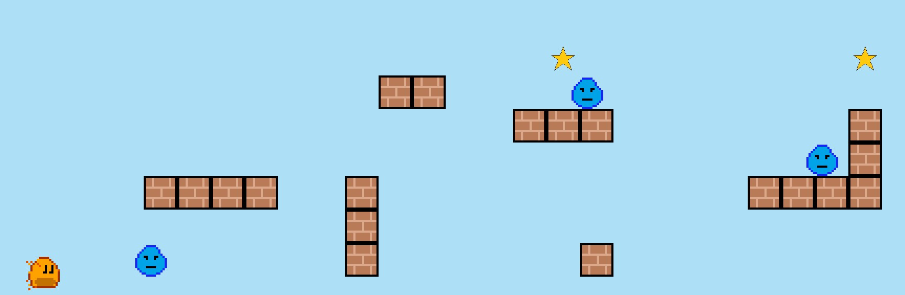
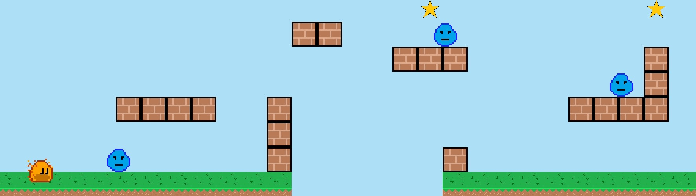

<a id="4-adding-the-remaining-components"></a>

# 4. 나머지 컴포넌트 추가


<a id="star"></a>

## 별

별은 꽤 간단합니다. 플랫폼 블록과 거의 같지만, 크기가 맥박치듯 변하도록 이펙트를 추가합니다.
이펙트가 올바르게 보이려면 오브젝트의 `Anchor`를 `center`로 바꿔야 합니다. 즉, 위치를
이미지 크기의 절반만큼 조정해야 합니다. 간결함을 위해
클래스 전체를 추가한 다음 추가로 바뀐 점을 설명하겠습니다.

```dart
import 'package:flame/collisions.dart';
import 'package:flame/components.dart';
import 'package:flame/effects.dart';
import 'package:flutter/material.dart';

import '../ember_quest.dart';

class Star extends SpriteComponent with HasGameRef<EmberQuestGame> {
  final Vector2 gridPosition;
  double xOffset;

  final Vector2 velocity = Vector2.zero();

  Star({
    required this.gridPosition,
    required this.xOffset,
  }) : super(size: Vector2.all(64), anchor: Anchor.center);

  @override
  void onLoad() {
    final starImage = gameRef.images.fromCache('assets/images/star.png');
    sprite = Sprite(starImage);
    position = Vector2(
      (gridPosition.x * size.x) + xOffset + (size.x / 2),
      gameRef.size.y - (gridPosition.y * size.y) - (size.y / 2),
    );
    add(RectangleHitbox(collisionType: CollisionType.passive));
    add(
      SizeEffect.by(
        Vector2(-24, -24),
        EffectController(
          duration: .75,
          reverseDuration: .5,
          infinite: true,
          curve: Curves.easeOut,
        ),
      ),
    );
  }

  @override
  void update(double dt) {
    velocity.x = gameRef.objectSpeed;
    position += velocity * dt;
    if (position.x < -size.x) removeFromParent();
    super.update(dt);
  }
}
```

앵커 외에 별과 플랫폼의 차이점은 다음 부분뿐입니다.

```dart
add(
  SizeEffect.by(
    Vector2(-24, -24),
    EffectController(
      duration: .75,
      reverseDuration: .5,
      infinite: true,
      curve: Curves.easeOut,
    ),
  ),
);
```

`SizeEffect`는 [문서](../../flame/effects.md#sizeeffectby)를 보는 것이
가장 좋습니다. 간단히 말해, 별의 크기를
양방향으로 -24픽셀만큼 줄이고 `EffectController`를 사용해 무한히 맥박치게 합니다.

다음과 같이 `lib/ember_quest.dart` 파일에 별을 추가하는 것을 잊지 마세요.

```dart
case Star:
  world.add(
    Star(
      gridPosition: block.gridPosition,
      xOffset: xPositionOffset,
    ),
  );
```

게임을 실행하면 이제 맥박치는 별이 보일 것입니다!


<a id="water-enemy"></a>

## 물 적

이제 오브젝트에 이펙트를 추가하는 방법을 알았으니, 물방울 적에도 똑같이 해 봅시다.
`lib/actors/water_enemy.dart`를 열고 다음 코드를 추가합니다.

```dart
import 'package:flame/collisions.dart';
import 'package:flame/components.dart';
import 'package:flame/effects.dart';

import '../ember_quest.dart';

class WaterEnemy extends SpriteAnimationComponent
    with HasGameRef<EmberQuestGame> {
  final Vector2 gridPosition;
  double xOffset;

  final Vector2 velocity = Vector2.zero();

  WaterEnemy({
    required this.gridPosition,
    required this.xOffset,
  }) : super(size: Vector2.all(64), anchor: Anchor.bottomLeft);

  @override
  void onLoad() {
    animation = SpriteAnimation.fromFrameData(
      gameRef.images.fromCache('assets/images/water_enemy.png'),
      SpriteAnimationData.sequenced(
        amount: 2,
        textureSize: Vector2.all(16),
        stepTime: 0.70,
      ),
    );
    position = Vector2(
      (gridPosition.x * size.x) + xOffset,
      gameRef.size.y - (gridPosition.y * size.y),
    );
    add(RectangleHitbox(collisionType: CollisionType.passive));
    add(
      MoveEffect.by(
        Vector2(-2 * size.x, 0),
        EffectController(
          duration: 3,
          alternate: true,
          infinite: true,
        ),
      ),
    );
  }

  @override
  void update(double dt) {
    velocity.x = gameRef.objectSpeed;
    position += velocity * dt;
    if (position.x < -size.x) removeFromParent();
    super.update(dt);
  }
}

```

물방울 적은 Ember와 마찬가지로 애니메이션이므로 이 클래스는
`SpriteAnimationComponent` 클래스를 상속하지만, 앞에서 별과 플랫폼에 사용한 코드를
모두 그대로 사용합니다. 유일한 차이점은 `SizeEffect` 대신
`MoveEffect`를 사용한다는 것입니다. 가장 좋은 정보는 [도움말
문서](../../flame/effects.md#sizeeffectby)에서 얻을 수 있습니다.

간단히 말해, `MoveEffect`는 3초 동안 지속되고, 방향을 번갈아 바꾸며, 무한히 실행됩니다.
적을 왼쪽으로 128픽셀(-2 x 이미지 너비) 이동시킵니다.

다음과 같이 `lib/ember_quest.dart` 파일에 물 적을 추가하는 것을 잊지 마세요.

```dart
case WaterEnemy:
    world.add(
      WaterEnemy(
       gridPosition: block.gridPosition,
       xOffset: xPositionOffset,
      ),
    );
```

이제 게임을 실행하면 물 적이 표시되고 움직일 것입니다!




<a id="ground-blocks"></a>

## 땅 블록

마지막으로 표시해야 할 컴포넌트는 땅 블록입니다! 이 컴포넌트는 블록의 생명주기 동안
두 시점을 파악해야 하므로 다른 컴포넌트보다 더 복잡합니다.

- 블록이 추가될 때, 그것이 세그먼트의 마지막 블록이라면 그 위치를 전역 값으로
  업데이트해야 합니다.
- 블록이 제거될 때, 그것이 세그먼트의 첫 번째 블록이었다면 다음에 로드할 세그먼트를
  무작위로 가져와야 합니다.

그럼 플랫폼 블록을 그대로 복사한 기본 클래스부터 시작해 봅시다.

```dart
import 'package:flame/collisions.dart';
import 'package:flame/components.dart';
import 'package:flutter/material.dart';

import '../ember_quest.dart';

class GroundBlock extends SpriteComponent with HasGameRef<EmberQuestGame> {
  final Vector2 gridPosition;
  double xOffset;

  final Vector2 velocity = Vector2.zero();

  GroundBlock({
    required this.gridPosition,
    required this.xOffset,
  }) : super(size: Vector2.all(64), anchor: Anchor.bottomLeft);

  @override
  void onLoad() {
    final groundImage = gameRef.images.fromCache('assets/images/ground.png');
    sprite = Sprite(groundImage);
    position = Vector2(
      gridPosition.x * size.x + xOffset,
      gameRef.size.y - gridPosition.y * size.y,
    );
    add(RectangleHitbox(collisionType: CollisionType.passive));
  }

  @override
  void update(double dt) {
    velocity.x = gameRef.objectSpeed;
    position += velocity * dt;
    super.update(dt);
  }
}
```

가장 먼저 다룰 것은, 블록이 로드되는 가장 마지막 블록이라면 전역적으로 등록하는
것입니다. 이를 위해 `lib/ember_quest.dart`에 다음 두 개의 새 전역 변수를 추가합니다.

```dart
  late double lastBlockXPosition = 0.0;
  late UniqueKey lastBlockKey;
```

땅 블록 클래스 맨 위에 다음 변수를 선언합니다.

```dart
final UniqueKey _blockKey = UniqueKey();
```

이제 땅 블록의 `onLoad` 메서드 끝에 다음을 추가합니다.

```dart
if (gridPosition.x == 9 && position.x > gameRef.lastBlockXPosition) {
  gameRef.lastBlockKey = _blockKey;
  gameRef.lastBlockXPosition = position.x + size.x;
}
```

여기서 하는 일은, 이 블록이 10번째 블록(세그먼트 격자는 0부터 시작하므로 9)이고
이 블록의 위치가 전역 `lastBlockXPosition`보다 크다면, 전역 블록 키를
이 블록의 키로 설정하고 전역 `lastBlockXPosition`을 이 블록의 위치에 이미지 너비를 더한 값으로
설정하는 것뿐입니다(앵커가 왼쪽 아래이고, 다음 블록이 바로 옆에 붙어 정렬되도록 하려는 것입니다).

이제 이 정보를 업데이트하는 부분을 처리할 수 있습니다. `update` 메서드에 다음 코드를 추가합니다.

```dart
  @override
  void update(double dt) {
    velocity.x = gameRef.objectSpeed;
    position += velocity * dt;

    if (gridPosition.x == 9) {
      if (gameRef.lastBlockKey == _blockKey) {
        gameRef.lastBlockXPosition = position.x + size.x - 10;
      }
    }

    super.update(dt);
  }
```

`gameRef.lastBlockXPosition`은 블록의 현재 x축 위치에 너비를 더하고 10픽셀을 뺀 값으로
업데이트됩니다. 약간 겹치게 되지만, `dt`의 잠재적인 편차 때문에 이렇게 하면
플레이어가 이동하는 동안 맵이 로드될 때 틈이 생기는 것을 막을 수 있습니다.


<a id="loading-the-next-random-segment"></a>

### 다음 무작위 세그먼트 로드하기

다음 무작위 세그먼트를 로드하기 위해 `dart:math`에 내장된 `Random()` 함수를
사용합니다. 다음 코드는 0(포함)부터 전달한 파라미터의 최댓값(미포함)까지의
무작위 정수를 얻습니다.

```dart
Random().nextInt(segments.length),
```

다시 땅 블록으로 돌아가서, 이제 'update' 메서드에서 방금 추가한 다른 블록 앞에
다음을 추가할 수 있습니다.

```dart
if (position.x < -size.x) {
  removeFromParent();
  if (gridPosition.x == 0) {
    gameRef.loadGameSegments(
      Random().nextInt(segments.length),
      gameRef.lastBlockXPosition,
    );
  }
}
```

이것은 다른 오브젝트에 있는 코드를 확장한 것일 뿐입니다. 블록이
화면 밖으로 나가고 그 블록이 세그먼트의 첫 번째 블록이라면, 게임 클래스의 `loadGameSegments`
메서드를 호출하면서 0부터 세그먼트 개수 사이의 무작위 수를 얻고
오프셋을 전달합니다. `Random()`이나 `segments.length`가 자동으로 import되지 않는다면 다음이 필요합니다.

```dart
import 'dart:math';

import '../managers/segment_manager.dart';
```

따라서 전체 땅 블록 클래스는 다음과 같아야 합니다.

```dart
import 'dart:math';

import 'package:flame/collisions.dart';
import 'package:flame/components.dart';
import 'package:flutter/material.dart';

import '../ember_quest.dart';
import '../managers/segment_manager.dart';

class GroundBlock extends SpriteComponent with HasGameRef<EmberQuestGame> {
  final Vector2 gridPosition;
  double xOffset;
  
  final UniqueKey _blockKey = UniqueKey();
  final Vector2 velocity = Vector2.zero();

  GroundBlock({
    required this.gridPosition,
    required this.xOffset,
  }) : super(size: Vector2.all(64), anchor: Anchor.bottomLeft);

  @override
  void onLoad() {
    final groundImage = gameRef.images.fromCache('assets/images/ground.png');
    sprite = Sprite(groundImage);
    position = Vector2(
      gridPosition.x * size.x + xOffset,
      gameRef.size.y - gridPosition.y * size.y,
    );
    add(RectangleHitbox(collisionType: CollisionType.passive));
    if (gridPosition.x == 9 && position.x > gameRef.lastBlockXPosition) {
      gameRef.lastBlockKey = _blockKey;
      gameRef.lastBlockXPosition = position.x + size.x;
    }
  }

  @override
  void update(double dt) {
    velocity.x = gameRef.objectSpeed;
    position += velocity * dt;

    if (position.x < -size.x) {
      removeFromParent();
      if (gridPosition.x == 0) {
        gameRef.loadGameSegments(
          Random().nextInt(segments.length),
          gameRef.lastBlockXPosition,
        );
      }
    }
    if (gridPosition.x == 9) {
      if (gameRef.lastBlockKey == _blockKey) {
        gameRef.lastBlockXPosition = position.x + size.x - 10;
      }
    }

    super.update(dt);
  }
}

```

마지막으로 다음을 추가해 `lib/ember_quest.dart`에 땅 블록을 추가하는 것을 잊지 마세요.

```dart
case GroundBlock:
  world.add(
    GroundBlock(
      gridPosition: block.gridPosition,
      xOffset: xPositionOffset,
    ),
  );
```

코드를 실행하면 이제 게임이 다음과 같이 보일 것입니다.



잠깐만요! Ember가 땅 한가운데에 있다고 말할 수도 있습니다. 맞습니다. Ember의
`Anchor`가 center로 설정되어 있기 때문입니다. 괜찮습니다. Ember에 이동과 충돌을 추가하는
[](step_5.md)에서 이 문제를 해결하겠습니다!
