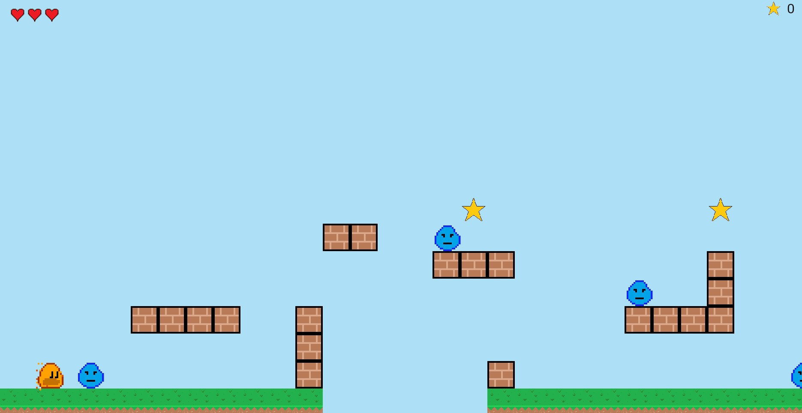

<a id="6-adding-the-hud"></a>

# 6. HUD 추가


<a id="setting-up-the-hud"></a>

## HUD 설정

이제 게임이 돌아가고 있으니 나머지 코드는 꽤 쉽게 작성할 수 있을 것입니다. HUD를 준비하기 위해
`lib/ember_quest.dart`에 변수 몇 개를 추가해야 합니다. 클래스 맨 위에 다음을
추가합니다.

```dart
int starsCollected = 0;
int health = 3;
```

먼저 `lib/overlays`라는 폴더를 만들고, 그 폴더 안에 `heart.dart`라는 컴포넌트를
만듭니다. 이것은 게임 왼쪽 위 모서리에 있는 체력 표시 컴포넌트가
됩니다. 다음 코드를 추가합니다.

```dart
import 'package:ember_quest/ember_quest.dart';
import 'package:flame/components.dart';

enum HeartState {
  available,
  unavailable,
}

class HeartHealthComponent extends SpriteGroupComponent<HeartState>
    with HasGameRef<EmberQuestGame> {
  final int heartNumber;

  HeartHealthComponent({
    required this.heartNumber,
    required super.position,
    required super.size,
    super.scale,
    super.angle,
    super.anchor,
    super.priority,
  });

  @override
  Future<void> onLoad() async {
    await super.onLoad();
    final availableSprite = await gameRef.loadSprite(
      'assets/images/heart.png',
      srcSize: Vector2.all(32),
    );

    final unavailableSprite = await gameRef.loadSprite(
      'assets/images/heart_half.png',
      srcSize: Vector2.all(32),
    );

    sprites = {
      HeartState.available: availableSprite,
      HeartState.unavailable: unavailableSprite,
    };

    current = HeartState.available;
  }

  @override
  void update(double dt) {
    if (gameRef.health < heartNumber) {
      current = HeartState.unavailable;
    } else {
      current = HeartState.available;
    }
    super.update(dt);
  }
}

```

`HeartHealthComponent`는 앞에서 만든 하트 이미지를 사용하는 [SpriteGroupComponent](../../flame/components/sprite_components.md#spritegroupcomponent)일
뿐입니다. 특별한 점은 컴포넌트를 생성할 때
`heartNumber`가 필요하다는 것입니다. 그래서 `update` 메서드에서
`gameRef.health`가 `heartNumber`보다 작은지 확인하고, 그렇다면 컴포넌트의 상태를
unavailable로 바꿉니다.

이 모든 것을 합치기 위해 같은 폴더에 `hud.dart`를 만들고 다음 코드를 추가합니다.

```dart
import 'package:flame/components.dart';
import 'package:flutter/material.dart';

import '../ember_quest.dart';
import 'heart.dart';

class Hud extends PositionComponent with HasGameRef<EmberQuestGame> {
  Hud({
    super.position,
    super.size,
    super.scale,
    super.angle,
    super.anchor,
    super.children,
    super.priority = 5,
  });

  late TextComponent _scoreTextComponent;

  @override
  Future<void> onLoad() async {
    _scoreTextComponent = TextComponent(
      text: '${gameRef.starsCollected}',
      textRenderer: TextPaint(
        style: const TextStyle(
          fontSize: 32,
          color: Color.fromRGBO(10, 10, 10, 1),
        ),
      ),
      anchor: Anchor.center,
      position: Vector2(gameRef.size.x - 60, 20),
    );
    add(_scoreTextComponent);

    final starSprite = await gameRef.loadSprite('assets/images/star.png');
    add(
      SpriteComponent(
        sprite: starSprite,
        position: Vector2(gameRef.size.x - 100, 20),
        size: Vector2.all(32),
        anchor: Anchor.center,
      ),
    );

    for (var i = 1; i <= gameRef.health; i++) {
      final positionX = 40 * i;
      add(
        HeartHealthComponent(
          heartNumber: i,
          position: Vector2(positionX.toDouble(), 20),
          size: Vector2.all(32),
        ),
      );
    }
  }

  @override
  void update(double dt) {
    _scoreTextComponent.text = '${gameRef.starsCollected}';
  }
}

```

`onLoad` 메서드에서 1부터 `gameRef.health` 값까지 반복하면서 필요한 개수만큼
하트를 만드는 것을 볼 수 있습니다. 마지막 단계는 게임에 HUD를 추가하는 것입니다.

`lib/ember_quest.dart`로 가서 `initializeGame` 메서드에 다음 코드를 추가합니다.

```dart
camera.viewport.add(Hud());
```

자동 import가 되지 않았다면 다음을 추가해야 합니다.

```dart
import 'overlays/hud.dart';
```

이제 게임을 실행하면 다음과 같이 보일 것입니다.




<a id="updating-the-hud-data"></a>

## HUD 데이터 업데이트

HUD를 마무리하기 전에 마지막으로 해야 할 일은 데이터를 업데이트하는 것입니다. 이를 위해
`lib/actors/ember.dart`를 열고 다음 코드를 추가해야 합니다.

`onCollision`

```dart
if (other is Star) {
  other.removeFromParent();
  gameRef.starsCollected++;
}
```

```dart
void hit() {
  if (!hitByEnemy) {
    gameRef.health--;
    hitByEnemy = true;
  }
  add(
    OpacityEffect.fadeOut(
      EffectController(
        alternate: true,
        duration: 0.1,
        repeatCount: 5,
      ),
    )..onComplete = () {
      hitByEnemy = false;
    },
  );
}
```

이제 게임을 실행하면 체력이 업데이트되고 별 개수가 적절히 증가하는 것을
볼 수 있습니다. 마지막으로 [](step_7)에서는 메인 메뉴와 게임 오버 메뉴를 추가해
게임을 완성하겠습니다.
