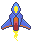

<a id="controlling-the-player-and-adding-some-graphics"></a>

# 플레이어 조작과 그래픽 추가

이제 게임의 기반과 플레이어 컴포넌트가 생겼으니 상호작용을 추가해 봅시다.
먼저 마우스/터치 제스처로 플레이어를 조작할 수 있게 하는 것부터 시작하겠습니다.

Flame은 컴포넌트에 추가하는 믹스인으로 입력을 처리하며, 제스처 종류마다 믹스인이 하나씩 있습니다. 드래그는
`DragCallbacks`이고, `FlameGame` 자체도 컴포넌트이므로 게임 클래스에 바로 추가해
리스너 메서드를 오버라이드할 수 있습니다. 여기서는 `onDragUpdate` 메서드를 사용하겠습니다.
수정된 코드는 다음과 같습니다.

```dart
import 'package:flame/events.dart';

class SpaceShooterGame extends FlameGame with DragCallbacks {
  late Player player;

  @override
  void onLoad() {
    // 생략
  }

  @override
  void onDragUpdate(DragUpdateEvent event) {
  }
}

```

이 시점에서 게임은 모든 드래그 업데이트 입력을 받고 있지만, 이 이벤트로 아직
아무것도 하지 않습니다.

이제 플레이어를 움직일 방법이 필요합니다. `Player` 컴포넌트를 게임 클래스 안의 변수에
저장하고, `Player`에 `move` 메서드를 추가한 다음, 둘을 연결하기만 하면
됩니다.

```dart
class Player extends PositionComponent { 
  static final _paint = Paint()..color = Colors.white;
  
  @override
  void render(Canvas canvas) {
    canvas.drawRect(size.toRect(), _paint);
  }

  void move(Vector2 delta) {
    position.add(delta);
  }
}

class SpaceShooterGame extends FlameGame with DragCallbacks {
  late Player player;

  @override
  Future<void> onLoad() async {
    await super.onLoad();

    player = Player()
      ..position = size / 2
      ..width = 50
      ..height = 100
      ..anchor = Anchor.center;

    add(player);
  }

  @override
  void onDragUpdate(DragUpdateEvent event) {
    player.move(event.localDelta);
  }
}
```

이게 전부입니다! 화면을 드래그하면 플레이어가 움직임을 따라오며, 이렇게 첫 번째 인터랙티브 게임을
구현했습니다!

다음 단계로 넘어가기 전에, 지루한 흰색 사각형을 멋진 그래픽으로 바꿔 봅시다.

Flame은 그래픽 렌더링을 돕는 많은 클래스를 제공합니다. 이 단계에서는
`Sprite` 클래스를 사용하겠습니다.

Flame에서 `Sprite`는 게임에서 정적 이미지 또는 이미지의 일부를 렌더링하는 데 사용됩니다. `FlameGame` 안에서
`Sprite`를 렌더링하려면 `Sprite` 기능을 컴포넌트로 감싼 `SpriteComponent` 클래스를
사용해야 합니다.

코드를 작성하기 전에 플레이어 스프라이트 이미지가 필요합니다. 아래 이미지를 마우스 오른쪽 버튼으로 클릭하고
"다른 이름으로 저장..."을 선택해 `assets/images/` 폴더에 `player-sprite.png`로 저장합니다.



이제 현재 구현을 리팩터링해 봅시다. 먼저 상속 대상을
`PositionComponent`에서 `SpriteComponent`(`PositionComponent`를 상속하는 컴포넌트)로
바꾸고 스프라이트를 로드합니다.

```dart
class Player extends SpriteComponent {
  void move(Vector2 delta) {
    position.add(delta);
  }
}

class SpaceShooterGame extends FlameGame with DragCallbacks {
  late Player player;

  @override
  Future<void>? onLoad() async {
    await super.onLoad();

    final playerSprite = await loadSprite('assets/images/player-sprite.png');
    player = Player()
      ..sprite = playerSprite
      ..x = size.x / 2
      ..y = size.y / 2
      ..width = 50
      ..height = 100
      ..anchor = Anchor.center;

    add(player);
  }

  @override
  void onDragUpdate(DragUpdateEvent event) {
    player.move(event.localDelta);
  }
}
```

이제 화면에 작은 파란색 우주선이 보일 것입니다!

짚고 넘어갈 만한 점이 몇 가지 있습니다.

- `PositionComponent`와 달리 `SpriteComponent`에는 `render` 메서드의 구현이 있으므로
이전의 오버라이드를 삭제할 수 있습니다.
- `FlameGame`에는 `loadSprite`처럼 에셋을 로드하는 메서드가 몇 가지 있습니다. 이 메서드들은
꽤 유용한데, 이를 사용하면 게임이 Flutter 위젯 트리에서 제거될 때 `FlameGame`이
캐시를 정리해 주기 때문입니다.

이 단계를 마치기 전에 할 수 있는 작은 개선이 하나 있습니다. 지금은
스프라이트를 로드해 컴포넌트에 전달하고 있습니다. 지금은 괜찮아 보일 수 있지만,
컴포넌트가 많은 게임을 상상해 보세요. 게임이 모든 컴포넌트의 에셋 로드를 책임진다면 코드가
금방 엉망이 될 수 있습니다.

`FlameGame`과 마찬가지로 컴포넌트에도 초기화를 위해 오버라이드할 수 있는 `onLoad` 메서드가
있습니다. 하지만 플레이어의 로드 메서드를 구현하기 전에, `FlameGame` 클래스의 속성과
`loadSprite` 메서드를 사용한다는 점에 유의하세요.

문제없습니다! 컴포넌트가 게임 클래스의 무언가에 접근해야 할 때마다 컴포넌트에
`HasGameRef` 믹스인을 섞으면 됩니다. 그러면 컴포넌트에 `gameRef`라는 새 변수가 추가되며,
이 변수는 컴포넌트가 실행 중인 게임 인스턴스를 가리킵니다. 이제 게임을
조금 리팩터링해 봅시다.

```dart
class Player extends SpriteComponent with HasGameRef<SpaceShooterGame> {

  Player() : super(
    size: Vector2(100, 150),
    anchor: Anchor.center,
  );

  @override
  Future<void> onLoad() async {
    await super.onLoad();

    sprite = await gameRef.loadSprite('assets/images/player-sprite.png');

    position = gameRef.size / 2;
  }

  void move(Vector2 delta) {
    position.add(delta);
  }
}

class SpaceShooterGame extends FlameGame with DragCallbacks {
  late Player player;

  @override
  Future<void> onLoad() async {
    await super.onLoad();

    player = Player();

    add(player);
  }

  @override
  void onDragUpdate(DragUpdateEvent event) {
    player.move(event.localDelta);
  }
}
```

이제 게임을 실행해도 시각적인 차이는 없지만, 게임을 개발하기 위한 더 확장성 있는
구조를 갖추게 되었습니다. 이것으로 이 단계를 마칩니다!

```{flutter-app}
:sources: ../tutorials/space_shooter/app
:page: step2
:show: popup code
```

[다음 단계: 애니메이션과 깊이감 추가](./step_3.md)
