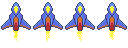
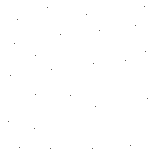
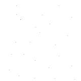
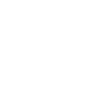

<a id="adding-animations-and-depth"></a>

# 애니메이션과 깊이감 추가

이제 우주선 그래픽이 있고 직접 조작할 수도 있으니, 조금 더 게임다운 모습이
되었습니다.

하지만 지금까지의 게임은 너무 지루합니다. 우주선은 정적인 스프라이트일 뿐이고 배경은
그저 검은 화면입니다.

이 단계에서는 이를 개선하는 방법을 살펴봅니다. 플레이어의 정적인 그래픽을
애니메이션으로 바꾸고, 게임 배경에 패럴랙스(parallax)를 추가해 멋진 깊이감과 움직임을
만들어 보겠습니다.

그럼 플레이어 우주선에 애니메이션을 추가하는 것부터 시작해 봅시다! 이를 위해 스프라이트
애니메이션이라는 것을 사용합니다. 스프라이트 애니메이션은 스프라이트 모음으로 구성된 애니메이션으로, 각
스프라이트가 하나의 프레임을 나타내며, 일정 시간 동안 스프라이트를 차례로 렌더링해
애니메이션 효과를 만들어 냅니다.

이해를 돕기 위해, 우리가 사용할 애니메이션은 다음과 같습니다. 이미지 하나에 4개의
개별 이미지(또는 프레임)가 들어 있다는 점에 주목하세요. 아래 이미지를 마우스 오른쪽 버튼으로 클릭하고 "다른 이름으로 저장..."을 선택해
`assets/images/` 폴더에 `player.png`로 저장합니다(앞에서 사용한 정적인 `player-sprite.png`를
대체합니다).



Flame은 이런 이미지를 다루기 위한 전용 클래스인 `SpriteAnimation`과 그 컴포넌트
래퍼인 `SpriteAnimationComponent`를 제공합니다. `Player` 컴포넌트를 애니메이션으로 바꾸는 것은 꽤
간단합니다. 이제 컴포넌트가 어떻게 생겼는지 살펴보세요.

```dart
class Player extends SpriteAnimationComponent
    with HasGameRef<SpaceShooterGame> {

  Player() : super(
    size: Vector2(100, 150),
    anchor: Anchor.center,
  );

  @override
  Future<void> onLoad() async {
    await super.onLoad();

    animation = await gameRef.loadSpriteAnimation(
      'assets/images/player.png',
      SpriteAnimationData.sequenced(
        amount: 4,
        stepTime: .2,
        textureSize: Vector2(32, 48),
      ),
    );

    position = gameRef.size / 2;
  }

  // 다른 메서드는 생략
}
```

변경 사항을 하나씩 살펴봅시다.

- 먼저 `Player` 컴포넌트가 `SpriteComponent` 대신 `SpriteAnimationComponent`를
상속하도록 바꿨습니다.
- `onLoad` 메서드에서 이제 `loadSprite` 대신 `gameRef.loadSpriteAnimation` 헬퍼를
 사용하고, 반환된 값으로 `animation` 속성을 설정합니다.

`SpriteAnimationData` 클래스는 처음에는 복잡해 보일 수 있지만 실제로는 꽤
간단합니다. `sequenced` 생성자를 사용했다는 점에 주목하세요. 이는 프레임이 재생될 순서대로
이미 배치된 애니메이션 이미지를 로드하기 위한 헬퍼입니다. 그리고

- `amount`는 애니메이션에 몇 개의 프레임이 있는지 정의합니다. 여기서는 `4`입니다.
- `stepTime`은 각 프레임이 다음 프레임으로 바뀌기 전까지 렌더링되는 시간(초)입니다.
- `textureSize`는 이미지의 각 프레임을 정의하는 픽셀 단위 크기입니다.

이 모든 정보를 바탕으로 이제 `SpriteAnimationComponent`가 자동으로
애니메이션을 재생합니다!

이제 게임 배경에 깊이감과 활력을 더해 봅시다. 물론 방법은 여러 가지가
있지만, 이 튜토리얼에서는 패럴랙스 스크롤링이라는 아이디어를 살펴보겠습니다. 처음 들어 보았다면,
배경 이미지들이 서로 다른 속도로 카메라를 지나가도록 하는 기법입니다. 이렇게 하면 깊이감이 생길 뿐 아니라
게임의 움직임도 훨씬 좋아집니다. 패럴랙스 스크롤링에 대해 더 알아보고 싶다면
[Wikipedia](https://en.wikipedia.org/wiki/Parallax_scrolling)의 이 문서를 확인하세요.

Flame은 패럴랙스 스크롤링을 구현하는 클래스를 기본으로 제공합니다. 바로 `Parallax`와
`ParallaxComponent`입니다. 패럴랙스 배경을 위해 별 레이어 이미지 3개가 필요합니다.
아래 각 이미지를 마우스 오른쪽 버튼으로 클릭하고 "다른 이름으로 저장..."을 선택해 `assets/images/` 폴더에 저장합니다.

- `stars_0.png` (가장 먼 레이어): 
- `stars_1.png` (중간 레이어): 
- `stars_2.png` (가장 가까운 레이어): 

이제 이 새 기능을 게임에 어떻게 추가하는지 살펴봅시다.

```dart
import 'package:flame/components.dart';
import 'package:flame/events.dart';
import 'package:flame/game.dart';
import 'package:flame/parallax.dart';
import 'package:flutter/material.dart';

class SpaceShooterGame extends FlameGame with DragCallbacks {
  late Player player;

  @override
  Future<void> onLoad() async {
    final parallax = await loadParallaxComponent(
      [
        ParallaxImageData('assets/images/stars_0.png'),
        ParallaxImageData('assets/images/stars_1.png'),
        ParallaxImageData('assets/images/stars_2.png'),
      ],
      baseVelocity: Vector2(0, -5),
      repeat: ImageRepeat.repeat,
      velocityMultiplierDelta: Vector2(0, 5),
    );
    add(parallax);

    player = Player();
    add(player);
  }

  @override
  void onDragUpdate(DragUpdateEvent event) {
    player.move(event.localDelta);
  }
}
```

위 코드를 보면 이제 `FlameGame` 클래스의 `loadParallaxComponent` 헬퍼
메서드를 사용해 `ParallaxComponent`를 직접 로드하고 게임에 추가한다는 것을 알 수 있습니다.

여기서 사용한 인자는 다음과 같습니다.

- 첫 번째 인자는 위치 인자로, `ParallaxData`의 리스트여야 합니다. Flame에는
몇 가지 종류의 `ParallaxData`가 있으며, 이 튜토리얼에서는 패럴랙스 스크롤링 효과에서 `image`인
레이어를 설명하는 `ParallaxImageData`를 사용합니다. 이 리스트는 패럴랙스에 원하는 모든 레이어를
Flame에 알려 줍니다.
- `baseVelocity`는 모든 값의 기준값입니다. 여기에 `Vector2(0, -5)`를 전달하면
가장 느린 레이어가 `x`축으로는 초당 0픽셀, `y`축으로는 초당 `-5`픽셀로
움직인다는 뜻입니다.
- 마지막으로 `velocityMultiplierDelta`는 각 레이어마다 기준값에 적용되는 벡터이며,
예제에서는 `y`축에만 `5`의 배율을 적용합니다.


이제 게임을 실행해 보세요. 훨씬 역동적으로 보여서, 우주선이 정말로 별 사이를 가로지르고 있다는
느낌을 플레이어에게 더 실감 나게 전달합니다!

```{flutter-app}
:sources: ../tutorials/space_shooter/app
:page: step3
:show: popup code
```

[다음 단계: 총알 추가](./step_4.md)
