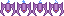

<a id="adding-enemies"></a>

# 적 추가

이제 우주선이 사격할 수 있으니, 플레이어가 쏠 대상이 필요합니다! 그래서
이 단계에서는 게임에 적을 추가하는 작업을 하겠습니다.

먼저 게임 속 적을 나타낼 `Enemy` 클래스를 만들어 봅시다. 아래 이미지를 마우스 오른쪽 버튼으로 클릭하고
"다른 이름으로 저장..."을 선택해 `assets/images/` 폴더에 `enemy.png`로 저장합니다.



```dart
class Enemy extends SpriteAnimationComponent with HasGameRef<SpaceShooterGame> {

  Enemy({
    super.position,
  }) : super(
          size: Vector2.all(enemySize),
          anchor: Anchor.center,
        );


  static const enemySize = 50.0;

  @override
  Future<void> onLoad() async {
    await super.onLoad();

    animation = await gameRef.loadSpriteAnimation(
      'assets/images/enemy.png',
      SpriteAnimationData.sequenced(
        amount: 4,
        stepTime: .2,
        textureSize: Vector2.all(16),
      ),
    );
  }

  @override
  void update(double dt) {
    super.update(dt);

    position.y += dt * 250;

    if (position.y > gameRef.size.y) {
      removeFromParent();
    }
  }
}
```

지금은 `Enemy` 클래스가 `Bullet` 클래스와 매우 비슷하다는 점에 주목하세요. 차이점은
크기, 애니메이션 정보, 그리고 총알은 아래에서 위로 이동하는 반면 적은
위에서 아래로 이동한다는 것뿐이므로 새로운 내용은 없습니다.

다음으로 게임에서 적이 생성되도록 해야 합니다. 로직은 간단합니다.
화면 위쪽에서 `x`축의 무작위 위치에 적이 생성되도록 하겠습니다.

이번에도 게임의 `update()` 메서드에 시간 기반 이벤트를 모두 직접 추가하고,
적의 x 위치를 얻기 위한 random 인스턴스를 유지하는 등의 작업을 할 수도 있지만, Flame은
이 모든 것을 직접 작성하지 않아도 되는 방법을 제공합니다. 바로 `SpawnComponent`를 사용하는 것입니다! 그러니
`SpaceShooterGame.onLoad()` 메서드에 다음 코드를 추가해 봅시다.

```dart
    add(
      SpawnComponent(
        factory: (index) {
          return Enemy();
        },
        period: 1,
        area: Rectangle.fromLTWH(0, 0, size.x, -Enemy.enemySize),
      ),
    );
```

`SpawnComponent`는 몇 가지 인자를 받습니다. 코드에 나오는 순서대로 살펴봅시다.

- `factory`는 생성해야 할 컴포넌트의 인덱스를 받는 함수를 받습니다. 우리
코드에서는 인덱스를 사용하지 않지만, 더 고급 생성 루틴을 만들 때 유용합니다.
이 함수는 생성된 컴포넌트를 반환해야 하며, 여기서는 `Enemy`의 새 인스턴스입니다.
- `period`는 새 컴포넌트가 생성되는 간격을 정의합니다.
- `area`는 생성된 컴포넌트가 배치될 수 있는 영역을 정의합니다. 여기서는
플레이 가능한 영역으로 들어오는 모습이 보이도록 화면 위쪽 바깥 영역에
배치되어야 합니다.

이것으로 이 짧은 단계를 마칩니다!

```{flutter-app}
:sources: ../tutorials/space_shooter/app
:page: step5
:show: popup code
```

[다음 단계: 충돌 감지](./step_6.md)
