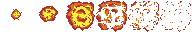

<a id="enemies-and-bullets-collision"></a>

# 적과 총알의 충돌

좋습니다. 이제 플레이할 수 있는 게임에 정말 가까워졌습니다. 적도 있고, 적에게 총알을 쏠 수도
있습니다! 이제 총알이 적에게 맞았을 때 무언가를 해야 합니다.

Flame은 충돌 감지 시스템을 기본으로 제공하며, 이를 사용해 총알과 적이 접촉했을 때의
로직을 구현하겠습니다. 결과적으로 둘 다 제거됩니다!

먼저 `FlameGame`에 컴포넌트 간의 충돌을 확인하고 싶다고 알려야
합니다. 이를 위해 게임 클래스 선언에 `HasCollisionDetection` 믹스인을
추가하기만 하면 됩니다.

```dart
class SpaceShooterGame extends FlameGame
    with DragCallbacks, HasCollisionDetection {
    // ...
}
```

이제 Flame은 컴포넌트끼리 충돌했는지 확인하기 시작합니다. 다음으로
어떤 컴포넌트가 충돌을 일으킬 수 있는지 지정해야 합니다.

여기서는 `Bullet`과 `Enemy` 컴포넌트가 해당하며, 이들에 히트박스를 추가해야 합니다.

히트박스란 다른 오브젝트와 부딪힐 수 있는, 컴포넌트 영역의 정의된 일부일 뿐입니다.
Flame은 히트박스를 정의하는 여러 클래스를 제공하는데, 그중 가장 간단한 것은
`RectangleHitbox`로, 이름에서 알 수 있듯이 사각형 영역을 컴포넌트의
히트박스로 설정합니다.

히트박스도 컴포넌트이므로, 히트박스를 갖게 하고 싶은 컴포넌트에 그냥 추가하면 됩니다.
`Enemy` 클래스에 다음 줄을 추가하는 것부터 시작해 봅시다.

```dart
add(RectangleHitbox());
```

총알에도 똑같이 하되, 약간의 차이가 있습니다.

```dart
add(
  RectangleHitbox(
    collisionType: CollisionType.passive,
  ),
);
```

`collisionType`은 게임 성능에 직접적인 영향을 줄 수 있으므로 이해하는 것이
매우 중요합니다!

Flame에는 세 가지 충돌 타입이 있습니다.

- `active`는 active 또는 passive 타입의 다른 히트박스와 충돌합니다
- `passive`는 active 타입의 다른 히트박스와 충돌합니다
- `inactive`는 어떤 히트박스와도 충돌하지 않습니다

보통은 인스턴스 수가 더 많은 컴포넌트의 `hitboxes`를 passive로 지정하는 것이
현명합니다. 그러면 충돌 계산에는 포함되지만 스스로 충돌을 확인하지는 않으므로,
확인 횟수가 크게 줄어들어 게임 성능이
좋아집니다!

그리고 이 게임에서는 적보다 총알이 더 많을 것으로 예상되므로
총알의 충돌 타입을 passive로 설정합니다!

이제부터 Flame이 두 컴포넌트 사이의 충돌 확인을 처리해 주며,
우리는 충돌이 일어났을 때 무언가를 해야 합니다.

먼저 클래스 중 하나에서 충돌 이벤트를 받습니다. `Bullet`은
passive 충돌 타입이므로 충돌 확인 로직도 `Enemy` 클래스에 추가하겠습니다.

충돌 이벤트를 수신하려면 컴포넌트에 `CollisionCallbacks` 믹스인을 추가해야 합니다.
그러면 `onCollisionStart()`와 `onCollisionEnd()` 같은 메서드를 오버라이드할 수 있습니다.

그럼 `Enemy` 클래스를 몇 군데 수정해 봅시다.

```dart
class Enemy extends SpriteAnimationComponent
    with HasGameRef<SpaceShooterGame>, CollisionCallbacks {

  // 다른 메서드는 생략

  @override
  void onCollisionStart(
    List<Vector2> intersectionPoints,
    PositionComponent other,
  ) {
    super.onCollisionStart(intersectionPoints, other);

    if (other is Bullet) {
      removeFromParent();
      other.removeFromParent();
    }
  }
}
```

보시다시피 클래스에 믹스인을 추가하고 `onCollisionStart` 메서드를 오버라이드했습니다.
이 메서드에서 충돌한 컴포넌트가 `Bullet`인지 확인하고, 그렇다면
현재 `Enemy` 인스턴스와 `Bullet`을 모두 제거합니다.

이제 게임을 실행하면 드디어 화면 아래로 기어 내려오는 적들을 물리칠 수 있습니다!

마지막 손질로, 게임에 더 많은 액션을 더하기 위해 폭발 애니메이션을 추가해 봅시다!

먼저 폭발 스프라이트 시트가 필요합니다. 아래 이미지를 마우스 오른쪽 버튼으로 클릭하고 "다른 이름으로 저장..."을 선택해
`assets/images/` 폴더에 `explosion.png`로 저장합니다.



이제 폭발 클래스를 만들어 봅시다.

```dart
class Explosion extends SpriteAnimationComponent
    with HasGameRef<SpaceShooterGame> {
  Explosion({
    super.position,
  }) : super(
          size: Vector2.all(150),
          anchor: Anchor.center,
          removeOnFinish: true,
        );


  @override
  Future<void> onLoad() async {
    await super.onLoad();

    animation = await gameRef.loadSpriteAnimation(
      'assets/images/explosion.png',
      SpriteAnimationData.sequenced(
        amount: 6,
        stepTime: .1,
        textureSize: Vector2.all(32),
        loop: false,
      ),
    );
  }
}
```

크게 새로운 내용은 없습니다. 다른 애니메이션 컴포넌트와 비교해 가장 큰 차이점은
`SpriteAnimationData.sequenced` 생성자에 `loop: false`를 전달하고
`removeOnFinish: true;`를 설정한다는 것입니다. 이렇게 하면 애니메이션이 끝났을 때
게임에서 자동으로 제거됩니다!

마지막으로 게임에 폭발을 추가하기 위해 `Enemy` 클래스의 `onCollisionStart()` 메서드를
조금 수정합니다.

```dart
  @override
  void onCollisionStart(
    List<Vector2> intersectionPoints,
    PositionComponent other,
  ) {
    super.onCollisionStart(intersectionPoints, other);

    if (other is Bullet) {
      removeFromParent();
      other.removeFromParent();
      gameRef.add(Explosion(position: position));
    }
  }
```

이게 전부입니다! 드디어 슈팅 게임에 필요한 최소한의 요소를 모두 갖춘
게임이 완성되었습니다. 여기서부터는 배운 내용을 활용해 게임에 더 많은 기능을 만들 수 있습니다.
예를 들어 플레이어가 적과 부딪히면 피해를 입게 하거나, 적이 반격하게 하거나, 아니면
둘 다 해 보는 건 어떨까요?

행운을 빕니다, 파일럿. 즐거운 코딩 되세요!

```{flutter-app}
:sources: ../tutorials/space_shooter/app
:page: step6
:show: popup code
```
